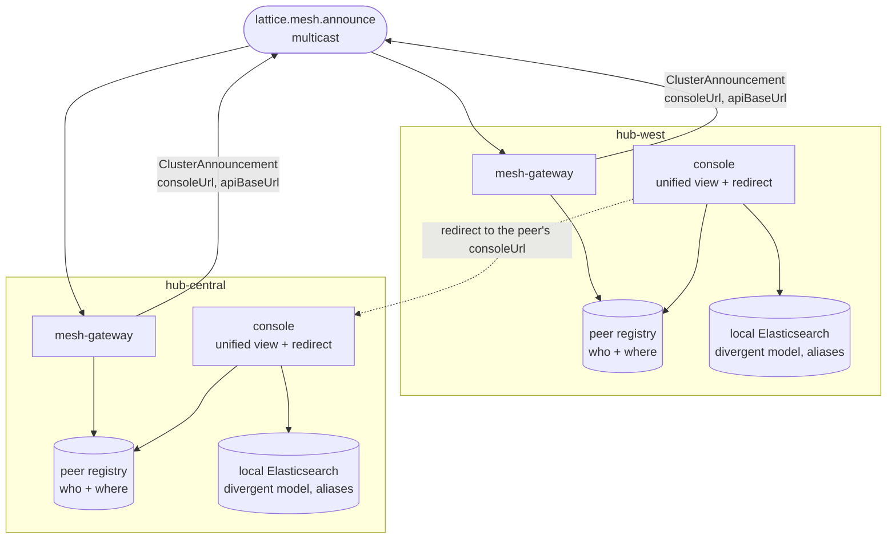

# Architecture design

System-level technical design: the mesh (Artemis discovery + cross-cluster interop + the `lattice-contract` envelopes), the per-service data-model approach, and the REST API structure. One doc per concern.

The mesh and interop core is designed, and so are authentication, the status-console live-status transport, and delivery. **Observability is half done**: the instrumentation half is settled and built ([observability.md](observability.md)), while the collection stack stays open behind the deferred hosting decision (locked #56). Deployment architecture (Docker images, the Kubernetes cluster, Helm, environments) is documented under [platform_protocol.md](../../protocol/platform_protocol.md) / [deploy_protocol.md](../../protocol/deploy_protocol.md) until it grows its own design doc.

---

## Docs

| Doc                                                | Concern                                                                                                                                                                                                         | Settles    |
|----------------------------------------------------|-----------------------------------------------------------------------------------------------------------------------------------------------------------------------------------------------------------------|------------|
| [mesh_envelopes.md](mesh_envelopes.md)             | The shared wire shapes: envelope header + typed payload, the MVP types, JSON + records, versioning + compatibility.                                                                                             | locked #31 |
| [mesh_discovery.md](mesh_discovery.md)             | How a cluster announces itself, the Artemis addressing (multicast announce + per-cluster inbox), peer liveness + TTL.                                                                                           | locked #29 |
| [mesh_broker_topology.md](mesh_broker_topology.md) | Where the broker lives: a broker per baseline, joined by Artemis federation; the join sequence, the failure model, and the local two-baseline stack.                                                            | locked #44 |
| [cluster_interop.md](cluster_interop.md)           | Shape A federation: each baseline owns its data; UI redirect to the owning baseline; the unified read-only view, rendered from the local registry (locked #61); per-baseline auth.                              | locked #37 |
| [data_model.md](data_model.md)                     | Per-service Elasticsearch approach: index-per-entity, read/write aliases, reindex-behind-alias, create-if-absent bootstrap.                                                                                     | locked #32 |
| [delivery_model.md](delivery_model.md)             | How a baseline reaches a customer and who runs it: exported image archives, hosting deferred, separate authorities per environment and per customer.                                                            | locked #55 |
| [api_structure.md](api_structure.md)               | The REST contract shape: `{data,error,meta}` envelope, error taxonomy, pagination, `/api/v1` versioning, the health surface, request hardening, `/docs`.                                                        | locked #17 |
| [observability.md](observability.md)               | What each service measures and where it exposes it: Micrometer + Prometheus on a dedicated management port, the mesh and data-layer metrics, cardinality discipline, and what is deliberately not instrumented. | locked #78 |

---

## How they fit together

**Read it for what is missing.** No console reaches the other baseline's registry, API, or Elasticsearch. Exactly two things cross between baselines: the announcement, and an operator following a redirect - which is why divergent local models never have to be reconciled.

The mesh is a discovery phone book: a versioned `ClusterAnnouncement` establishes who exists and where they are ([mesh_envelopes.md](mesh_envelopes.md), [mesh_discovery.md](mesh_discovery.md)); federation is a UI redirect to the owning baseline plus a unified read-only view rendered from this baseline's own registry, never pulled from a peer (locked #61; [cluster_interop.md](cluster_interop.md)); and each baseline keeps its own divergent, single-writer indices ([data_model.md](data_model.md)) that it alone owns and serves.
