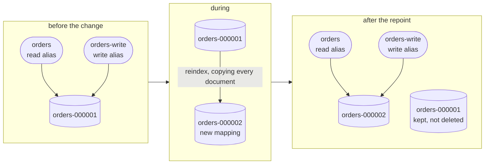

# Per-Service Data Model - Indices, Aliases, Bootstrap

The Elasticsearch data-model **approach** every service follows: how indices are shaped, how mappings evolve, and how they are provisioned. Settles the approach only; concrete per-service field mappings live in each service spec.

Related: [cluster_interop.md](cluster_interop.md) (divergent local models stay interoperable via Shape A redirect federation, not a shared schema), [locked_decisions.md](../../reference/locked_decisions.md) (#7 Elasticsearch, #14 divergent per-cluster models), [core_protocol.md](../../protocol/core_protocol.md) (naming, the ES-mapping TDD exception).

---

## Principle - divergent local models, single-writer indices

Each cluster owns its **own** Elasticsearch model and clusters may **diverge** (locked #14); interoperability is preserved by **Shape A federation** - an operator acts on the owning baseline directly, so a divergent local model never needs reconciling with a peer's (see [cluster_interop.md](cluster_interop.md)), not by a shared schema. Within a cluster, **one service owns each index and is its single writer** (the mapping seam - core_protocol concurrent-branches rule). This doc fixes the *shape and lifecycle* of those indices; the *fields* are per-service (below).

---

## Index shape + naming

- **Index-per-entity**, owned by the service that writes it (e.g. `orders`, `inventory`).
- **Naming (locked convention):** kebab-case index names, snake_case fields (e.g. index `node-status`, field `last_seen`).
- **Explicit mappings** - fields are declared, not left to Elasticsearch dynamic guessing (a strict-ish dynamic policy catches typo fields rather than silently indexing them).

---

## Mapping evolution - reindex behind an alias

Reads and writes go through **aliases**, never the concrete index directly, so a mapping change is invisible to callers:

| Alias          | Role  | Points at              |
|----------------|-------|------------------------|
| `orders`       | read  | current concrete index |
| `orders-write` | write | current concrete index |



Two properties fall out of the shape rather than out of care. **No caller ever names a concrete index**, so the repoint is invisible to every reader and writer - there is no downtime to schedule and nothing to coordinate. And **the old index is kept**, so a mapping change that turns out to be wrong is walked back by moving the aliases again rather than by restoring a backup.

A non-additive mapping change (retype/rename) is a new concrete index + reindex + alias repoint. An additive change (a new field) can be applied in place, but the alias indirection is kept from day one so the harder case never requires a retrofit.

---

## Bootstrap - create-if-absent on startup

Each service provisions its own indices through the shared repository base in `platform/lattice-common`:

- On startup the service **ensures its indices + aliases exist and carry the current mapping** (create the concrete index and the read/write aliases if missing; if present, apply the mapping **additively** in place).
- Versioned mapping definitions live **with the owning service**.
- A baseline is therefore **self-provisioning** - no external migration step for local dev / QA, and an **additive** mapping change (a new field) reaches an already-provisioned index on the next boot without a wipe or reindex.

```
service boot -> ensureIndex("orders", mapping-vN)
  missing -> create orders-000001 + aliases (orders, orders-write)
  present -> put-mapping (adds new fields; unchanged fields no-op; a breaking change is rejected)
```

Put-mapping is **additive only**: it adds newly declared fields to the live index and no-ops unchanged ones, but Elasticsearch rejects mutating an existing field's type - a **non-additive** change still takes the reindex-behind-alias path above, which the bootstrap does not attempt.

**Bootstrap failure is retried, not memoized.** A service that starts before Elasticsearch is reachable (the ordinary Kubernetes startup race) must not be permanently wedged by it. Services sequence reads and writes behind `RetryingGate` (in `lattice-common`), which memoizes a **successful** provisioning attempt but re-runs a **failed** one on the next request, so the process heals on its own once the dependency appears - no restart. A pending attempt is shared by concurrent callers, so a burst of requests issues one provisioning call rather than one per request. This relies on provisioning being idempotent (create-if-absent + additive put-mapping), which it is.

**Testing (documented ES-mapping TDD exception).** A mapping cannot be queried until the index exists, so index/mapping work ships with **spec-driven integration tests in the same change** - assert the mapping + aliases against a real Elasticsearch (Testcontainers), driven to green (core_protocol TDD exception; the [index-change skill](../../../.claude/skills/index-change/SKILL.md)).

---

## Cross-cluster note

Because models diverge, an index's fields on one hub need not match another's, and that is fine under Shape A: no baseline ever reads or writes a peer's index. An operator who needs to act on a peer is **redirected to that peer's own console** and works against the peer's own services + indices (see [cluster_interop.md](cluster_interop.md)); the unified view reads every peer's status from this baseline's own registry (locked #61), never from the peer's API and never from its index. So there is no cross-cluster copy, no `originRef`, and no canonical translation of one hub's document into another's.

---

## Concrete mappings are per-service (scope boundary)

This doc settles the **approach**. The actual field-level mappings for each service (`orders`, `inventory`) are defined in that service's spec under `docs/design/services/<name>.md` when the service is designed/built, so field decisions are not guessed ahead of their tickets.

> **Not every service owns an index.** A peer-registry index for the mesh-gateway was anticipated here and has since been **retired**: the peer registry is derived state that every peer re-announces on its heartbeat, so it is held in memory and rebuilt within one interval rather than persisted. See [mesh-gateway.md](../services/mesh-gateway.md).

---

## Decisions settled here

- Index-per-entity, single-writer per index; kebab-case indices, snake_case fields; explicit mappings.
- Read/write aliases from day one; mapping change = reindex-behind-alias + repoint.
- Create-if-absent bootstrap on service startup via the shared `lattice-common` repository base (self-provisioning local cluster).
- Divergent per-cluster models stay interoperable via Shape A redirect federation (act on the owning baseline), not a shared schema or cross-cluster translation.
- Concrete per-service field mappings deferred to `docs/design/services/*`.

Promoted to locked decisions - see [locked_decisions.md](../../reference/locked_decisions.md).
