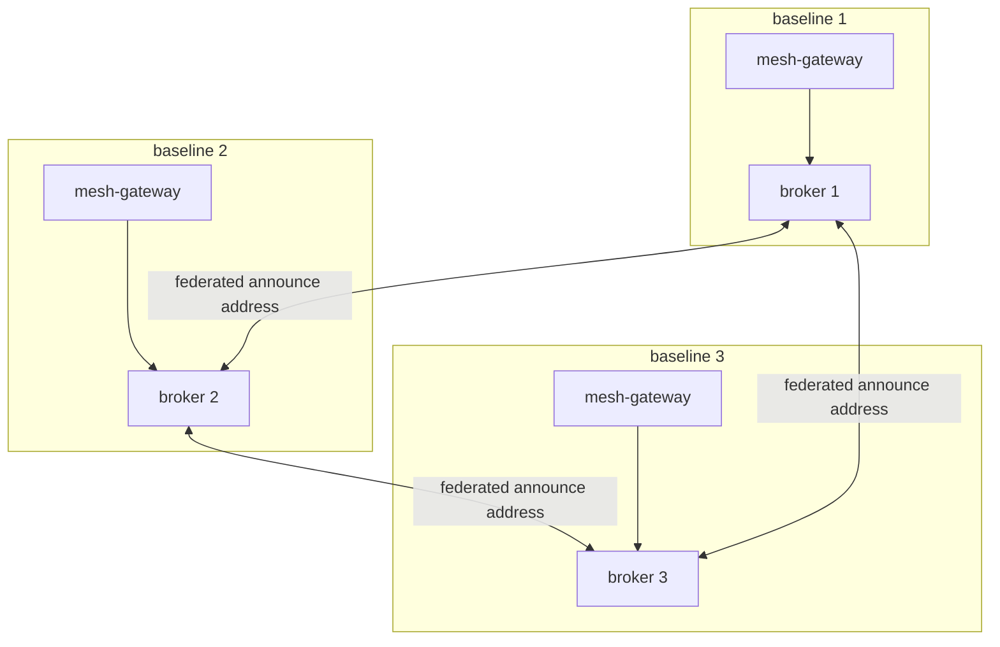
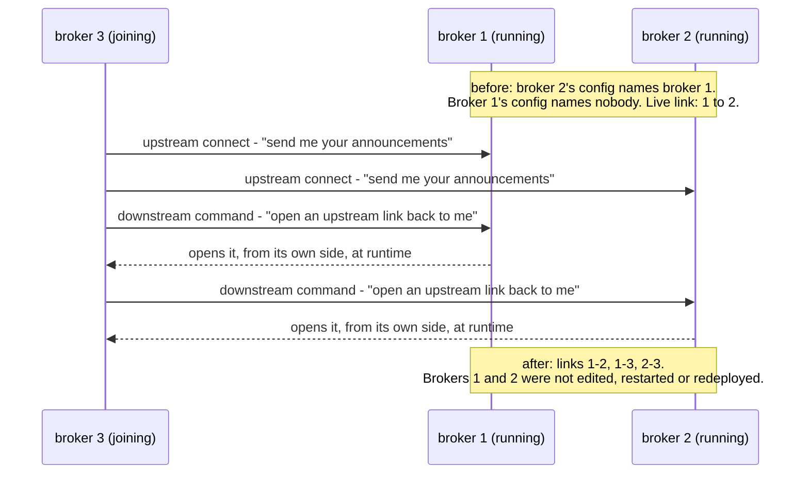

# Mesh Broker Topology

Where the Artemis broker lives, how announcements cross between baselines, and what survives a baseline going down. Settles the ownership question `platform_protocol.md` left open with the phrase "runs (or reaches)".

Related: [mesh_discovery.md](mesh_discovery.md) (announce cadence + peer liveness, unchanged by this doc), [mesh_envelopes.md](mesh_envelopes.md) (the `ClusterAnnouncement` shape), [cluster_interop.md](cluster_interop.md) (Shape A federation), [mesh-gateway.md](../services/mesh-gateway.md) (the sole mesh participant), [platform_protocol.md](../../protocol/platform_protocol.md) + [deploy_protocol.md](../../protocol/deploy_protocol.md) (broker deployment), [locked_decisions.md](../../reference/locked_decisions.md) (#8 Artemis, #13 mesh, #29 discovery, #37 Shape A, #41 AMQP client, #42 sole mesh participant, #43 health rollup).

---

## The defect this settles

Discovery only works if every baseline can reach the same `lattice.mesh.announce` address. Before this doc, that meant a **single** broker, and in the local stack that broker lived inside one baseline's compose project. A baseline that owned the broker could take the whole mesh down with it.

That contradicts the principle discovery is built on ([mesh_discovery.md](mesh_discovery.md)): discovery is decentralized, with no central registry. A broker is not a registry, but a single broker owned by one baseline has the same practical effect, because no peer can discover any other while it is gone.

The documentation was also self-contradictory. `platform_protocol.md` said each cluster "runs (or reaches)" a broker, which spans two very different topologies; `deploy_protocol.md` stated the stronger reading outright ("its own Artemis broker") while specifying no federation at all. Taken literally, per-baseline brokers that never federate would mean no baseline ever hears another, so discovery would silently never work. Both documents are corrected alongside this one.

**The constraint that decided it:** there cannot be a single point of failure. That rules out any single shared broker, dedicated or otherwise.

---

## The topology

**Every baseline runs its own Artemis broker, and the brokers are federated.**



The two arrow kinds are different relationships and it is worth reading them apart: a gateway
reaches **only its own** broker, and no service anywhere holds a peer broker's address. Every
cross-baseline arrow is between brokers.

- A baseline's services connect **only to their own baseline's broker**. No service ever holds a peer's broker address.
- Brokers replicate the announce address between themselves, so an announcement published on any broker reaches every baseline.
- No shared infrastructure exists that any baseline depends on. A baseline losing its broker loses only its own mesh link, and a baseline going down entirely takes nothing with it, because it was the only thing using that broker.

This keeps the promise `platform_protocol.md` makes about deployment ("deployed as part of the cluster") while making the decentralization principle true at the infrastructure layer, not just the application layer.

---

## Federation, not clustering

Artemis offers two ways to connect brokers, and they are not interchangeable. **Federation is the correct one here; clustering is not.**

| | Federation | Clustering |
|-----------------|--------------------------------------------------------------|--------------------------------------------------------|
| Coupling        | Brokers stay independent: separate administrative domains, separate configuration, potentially different broker versions | Tightly coupled, expected in one availability zone      |
| Intended for    | Wide-area links, cross-site, unreliable connections           | A local group of brokers acting as one                  |
| Failure posture | Built-in retry: a lost target is reconnected when it returns  | Assumes a stable, low-latency local network             |

Baselines are independent by definition (#12, #14): each owns its own data model, ships its own versioned baseline, and is operated separately. That is exactly the independence federation is designed for, and exactly what clustering assumes away. Clustering would also drag in cluster-wide discovery groups, which rely on multicast over User Datagram Protocol (UDP) and generally do not work across Kubernetes pods or sites.

**Address federation replicates messages published on an upstream address to a local address, and is supported only on multicast addresses.** `lattice.mesh.announce` is already addressed as a topic (locked #41, so announcements fan out to every peer rather than being load-balanced between them), so it qualifies with no change to the addressing model.

**Loop prevention:** a symmetric full mesh sets `max-hops=1`, so a message is copied once and never re-forwarded. Without it, three or more brokers federating each other would replicate cyclically.

---

## Joining the mesh

The hard requirement: **when a new baseline comes online, existing baselines must discover it automatically.** The new baseline may be configured with the existing baselines' details, but no existing baseline may need editing, restarting, or redeploying.

Artemis satisfies this through **downstream** federation configuration. A joining broker declares both directions against each peer it knows:

- an **upstream** connection, so the joining baseline **receives** each peer's announcements;
- a **downstream** connection, which commands that peer's broker to open an upstream connection **back**, so the peer **receives** the joining baseline's announcements.

Both live only in the joining broker's configuration.

### Worked example: baselines 1 and 2 have been running for months, then 3 joins



The asymmetry is the whole trick, and it is easy to read past: **every one of those six actions is
configured in broker 3's file alone.** The two links broker 1 and broker 2 end up holding were
created by them, at runtime, on a command - which is why the configuration on an existing broker
never mentions a peer and never has to change.

`max-hops=1` keeps this correct: baseline 3's announcement arriving at broker 1 is not re-forwarded from 1 to 2, because broker 2 already received it directly from broker 3. No duplicates.

Onboarding cost is therefore **linear in the number of peers, and paid entirely by the joining baseline**. Note that the naive upstream-only approach would instead require editing every existing broker on each join, growing quadratically as baselines multiply; downstream configuration is what avoids that.

### The one thing every broker must carry

"No configuration on the existing broker" is not literally true: a broker ignores an incoming federation command unless the user issuing it is authorized.

That authorization is **ordinary broker security**, not a federation-specific setting. Every Lattice broker grants a shared `lattice_federation` role the same permissions as its own services, and the joining baseline's `<federation>` presents that role's credential:

```xml
<!-- every Lattice broker, in every baseline. Generic: it names no peer. -->
<security-setting match="#">
   <permission type="manage" roles="amq,lattice_federation"/>
   <!-- ...the same create/delete/consume/send permissions... -->
</security-setting>
```

This names no peer and never changes as baselines come and go, so it ships once in the standard Lattice broker configuration. The requirement holds.

**How the role is proven has since changed** (locked #50, built in #62). The joining baseline no longer presents a shared password on its `<federation>` element - that credential is retired. It presents **its own X.509 certificate** on a mutual-TLS acceptor, and the peer maps it to the same generic `lattice_federation` role:

```xml
<!-- the joining baseline: no user, no password. The certificate is the credential. -->
<federation name="lattice-mesh-hub-east">
```

```properties
# every broker: one regular expression over the certificate's distinguished name. Names no peer.
lattice_peer = /(?=.*CN=[^,]+)(?=.*OU=Lattice Baseline)(?=.*O=Lattice).*/
lattice_federation = lattice_peer
```

The permission set above is untouched - only the proof changed. What it buys is a leak that is traceable to one baseline and revocable on its own, instead of a password every broker in the environment shared. See [per_baseline_identity.md](../features/per_baseline_identity.md), "Broker identity".

> **Correction.** This document originally specified a `downstream-authorization="lattice_federation"` attribute on `<federations>`. **No such attribute exists** in the Artemis version this project pins (2.44.0): it is absent from `artemis-configuration.xsd`, and a broker configured with it fails schema validation and does not start (`cvc-complex-type.3.2.2: Attribute 'downstream-authorization' is not allowed to appear in element 'federations'`). The mechanism above is what the schema actually supports, verified by running it. The property the original clause existed to guarantee - a peer's downstream command being accepted without that peer's broker naming anyone - is unchanged and is proven in the local stack. See locked decision #47.

### Joining broker configuration sketch

```xml
<federations>
  <federation name="lattice-mesh" user="artemis" password="artemis">
    <!-- receive peers' announcements -->
    <upstream name="from-peer-1">
      <static-connectors><connector-ref>peer-1-connector</connector-ref></static-connectors>
      <policy ref="mesh-announce"/>
    </upstream>

    <!-- have the peer receive ours, without editing the peer -->
    <downstream name="to-peer-1">
      <static-connectors><connector-ref>peer-1-connector</connector-ref></static-connectors>
      <policy ref="mesh-announce"/>
      <upstream-connector-ref>this-baseline-connector</upstream-connector-ref>
    </downstream>

    <address-policy name="mesh-announce" max-hops="1">
      <include address-match="lattice.mesh.announce"/>
    </address-policy>
  </federation>
</federations>
```

`upstream-connector-ref` names the connector the **peer** will use to reach back to this broker, so it must resolve to an address the peer can route to, not a local one.

Three constraints, each of which stops the broker starting if broken, all found by running it rather than by reading:

- **Element order inside `<federation>` follows the schema sequence:** `upstream`, then `downstream`, then `address-policy`. Declaring the policy first fails validation even though both links reference it.
- **`<policy>` precedes `<upstream-connector-ref>`** inside `<downstream>` (ARTEMIS-4902), which is simply where the schema puts it.
- **Every `name` is an XML `ID`, unique across the whole broker configuration.** Naming an upstream and a downstream after the same peer fails with `cvc-id.2: There are multiple occurrences of ID value`, so links are named for their direction (`from-peer-1` / `to-peer-1`), not for the peer.

Two further things the local stack settled, both invisible from the documentation:

- **The announce address must be declared `<multicast/>` in `broker.xml`.** Address federation matches only multicast addresses, and an address auto-created by whichever client connected first could be created anycast - which would break fan-out (locked #41) and silently exclude the address from federation.
- **`<connectors>` cannot be empty**, so a baseline naming no peer still declares its own reachable address there.

---

## Configuration surface

The peer list is **broker deployment configuration, not service configuration**. No service environment variable changes.

| Setting                                | Lives in                                   | Changes when                                       |
|----------------------------------------|--------------------------------------------|----------------------------------------------------|
| `ARTEMIS_URL` / `ARTEMIS_USER` / `ARTEMIS_PASSWORD` | service config (ConfigMap + Secret)        | never for federation; always this baseline's own broker |
| `downstream-authorization` role        | broker config, identical in every baseline | never                                              |
| upstream + downstream peer connectors  | the **joining** broker's config            | when this baseline deploys; never when a peer joins |
| `max-hops="1"`                         | broker federation policy                   | never, while the mesh is a full mesh               |
| federation credential                  | per-environment Secret                     | on rotation                                        |

**`ARTEMIS_URL` stays a single value.** Federation is broker-to-broker, so a service never needs a candidate list. Giving services a peer broker as failover was rejected: it would make a baseline announce onto another baseline's broker, reintroducing precisely the cross-baseline dependency this topology removes.

### Federation credential

For the minimum viable product, **all Lattice brokers authorize one shared federation role**, delivered per environment as a Secret. This is the only option that preserves the no-edit-on-join guarantee: a per-baseline broker user would have to be authorized on every existing broker, which is exactly the editing this design forbids.

The accepted trade-off: anyone holding that credential can publish announcements, so a leak means bogus peer rows appear in every baseline's registry. The blast radius is bounded by Shape A (#37), under which the mesh carries discovery only, and no work, order, or local document ever crosses it. A forged announcement cannot move data; it can only advertise a cluster that is not there.

This is explicitly an interim position. A per-baseline broker identity that does not cost the no-edit-on-join property is unresolved, and is carried into the per-baseline identity work (#38 covers REST authentication only, and says nothing about the broker).

---

## Failure model

| Event                          | This baseline                                                                 | Its peers                                     | Recovery                          |
|--------------------------------|-------------------------------------------------------------------------------|-----------------------------------------------|-----------------------------------|
| Its own broker down            | Services keep serving normally; cannot announce or receive; its registry ages **every** peer to `UNREACHABLE`; mesh-link state reports down | Age this baseline out to `UNREACHABLE`, otherwise unaffected | Automatic when the broker returns |
| The whole baseline down        | Down                                                                          | Age it out; keep discovering each other normally | Automatic on return               |
| Network partition between two  | Each ages the other out; both keep serving their own data                      | Unaffected pairs continue                     | Automatic on heal                 |
| A peer's broker down           | That one peer ages out                                                        | Only that peer is affected                    | Automatic                         |

The ticket's original question, whether a total discovery outage is tolerable, no longer arises: under this topology **no single failure can cause one**. The worst single-baseline failure removes that baseline from everyone's view, which is the honest and correct signal.

Every case above degrades gracefully and self-heals, and none requires manual intervention. This holds only once the connect-retry defect below is fixed.

---

## Mesh-link state (a local-only signal)

When a baseline's own broker link is down it hears nothing, so its registry ages **every** peer to `UNREACHABLE`. Rendered naively, the console would say "all peers are gone" when the truth is "we are the ones cut off". Those are different incidents with different responses, and an operator must not have to infer which one they are in from the fact that everything went silent at once.

The gateway already knows its own broker connection state, so it exposes it, and the console renders "mesh link down, peer data is last-known" rather than implying every peer died.

**This signal never rides the mesh.** It is served only on this baseline's own API, for the same reason locked #43 keeps the broker out of the health rollup: a signal about a broken link cannot travel over that link. If the broker is down, peers observe this baseline crossing its liveness deadline and going `UNREACHABLE`, which is the correct and only possible signal from their side.

The contract field and the console rendering land as their own piece of work, additively.

---

## Local stack

The local stack must exercise the real topology, or the one mechanism this design turns on stays untested until deploy.

- **Each baseline runs its own broker**, deployed by the chart into that baseline's own cluster and federating to its peers exactly as a real baseline would. No baseline borrows another's, so none is privileged.
- The three baselines sit in **three separate kind clusters**, reaching each other by node name on a NodePort over the shared bridge (locked #75) - a genuine cluster boundary rather than one flat network.
- This makes the local stack the place where federation, the join sequence, broker restart, loop prevention and revocation are actually proven.

### Startup ordering, and a defect it was hiding

The local stack once gated the gateway's startup on the broker being healthy. That contradicts locked #42, which says a broker outage must not stop this service serving, and it masked a real defect.

**The defect (fixed):** `MeshGatewayVerticle` connected to the broker exactly once, at startup. If that first connection failed, the mesh client was never assigned and every later announce failed permanently, because nothing re-attempted the connection. The self-healing reconnect in `AmqpMeshClient` only recovers a connection that was **once** established. A gateway that started before its broker therefore stayed mesh-deaf until it was restarted, reporting only a warning.

This matters more under this topology, not less: a per-baseline broker is restarted by that baseline's own operators, so "gateway starts before broker" becomes routine rather than exotic.

**How it was fixed:** `AmqpMeshClient` is now created without contacting the broker, and the first publish or subscribe is what dials. The gateway therefore holds a usable client whether or not the broker exists, and the existing self-healing path covers the *first* connection as well as a lost one. The announce heartbeat is the only driver - there is no separate retry timer to leak - and a continuing outage is reported once rather than on every tick. Verified by `MeshGatewayStartupIT`: two gateways deployed against a dead address discover each other once a broker claims it, with no restart.

**Order of work, deliberately:** fix the connect retry **first**, then remove the startup gate. Removing the gate first would convert a hidden defect into a live local startup race. The retry is now in, so the gate can be removed with the per-baseline broker work.

---

## Proven in QA

Originally verified on a two-baseline local stack, each running its own broker; the same properties are now exercised by the three-cluster stack (`deploy/k8s/mesh-clusters.sh`).

- **A runtime-created upstream link survives a restart of the receiving broker.** `hub-central`'s configuration has no record of `hub-east`; its link exists only because `hub-east`'s downstream command created it. Restarting `hub-central`'s broker and waiting showed discovery resume on its own, with `lastSeen` advancing past the restart. **Self-healing, not a silent discovery hole** - which was the open question, and the answer that matters.
- **Join with no peer edit.** `hub-central` discovers `hub-east` while naming no peer and never being edited, restarted, or redeployed. On its broker, `hub-east` carries an active upstream consumer that `hub-central` itself established on command. This is locked #44's central guarantee, demonstrated rather than assumed.
- **No duplicate delivery** - but it is a property of *who declares*, not of the mechanism, and that is worth stating because the local stack once broke it. Each peer must be declared by exactly **one** side of a pair. Naming a peer produces both an `upstream` (pull from them) and a `downstream` (command them to pull from us), so if both sides name each other the pair ends up with two links carrying the same address in the same direction, and every announcement is delivered twice. The peer registry dedupes by cluster id, so nothing above the broker shows it. Measured at hub-central's broker over 60 seconds: its own announcements arrived 6 times - one copy at the 10s heartbeat - while each peer's arrived 12 to 14, with four federation queues on the announce address where two would do. Fixed by having each baseline declare only the peers already present, which is what a real join does anyway (locked #44). Verified after the fix at one copy per peer, and pinned by the `loop-check` scenario, which reads the broker precisely because the registry cannot see this.
- **A baseline going down takes nothing with it.** Stopping `hub-east` entirely left `hub-central` serving its own data with readiness UP, ageing `hub-east` out to `UNREACHABLE` while **retaining** its last-known detail. Restarting it healed both directions with no restart of `hub-central`. This is the failure the topology was chosen to fix, and it now behaves as the failure model above describes.

### Proven with three baselines

Both gaps below were open while the local stack had two baselines. A third (`hub-west`) closes them, and what it found on the way is the reason it was worth building.

- **Loop prevention.** With three brokers every baseline is reachable from every other by two paths - directly, and via the third - so a re-forwarded announcement would arrive twice. Measured differentially at the broker rather than argued: the same broker receives 27 announcements per 90 seconds with three baselines and 18 with two, so the third contributes exactly one copy of its own announcements at the 10-second cadence. Re-forwarding would have contributed 18. `max-hops="1"` does what it exists for.
- **A third baseline joining a running pair.** `hub-west` joins two already-running baselines with neither of them edited, restarted, or redeployed. Onboarding cost stays linear and is paid by the joiner.

The same measurement settles a detail worth recording, and corrects an earlier reading of it: a gateway **does** receive its own announcements. The counts are `9 x (number of baselines)` - 27 with three and 18 with two - because the gateway's own subscription queue is on the same multicast address it publishes to, so it is routed its own copy alongside each federated one. The earlier note here said the opposite; it was inferred from figures taken while `hub-central` was silently missing one of its two federation links (see below), which made the absolute numbers one stream short. Only the absolutes were wrong - the differential, and so the loop-prevention conclusion, is unchanged.

### The naming constraint three baselines revealed

**A federation link name must be unique across the whole mesh, not merely within one broker's configuration.** A downstream command creates a link *on the peer* under the name the joiner chose, so two baselines that both name a downstream `to-hub-central` collide on that peer: the second is silently ignored and never federates back, with nothing logged at default levels.

This was invisible with two baselines, because a single joiner has nothing to collide with. When `hub-west` first joined, it and `hub-east` had both named their links for the direction alone; `hub-east` and `hub-west` each saw the full mesh while `hub-central` saw only `hub-east`, and a missing federation queue on `hub-west` was the only evidence.

Every link is therefore named for **the baseline that owns it** (`hub-west-to-hub-central`, not `to-hub-central`). That is unique by construction, and it is what keeps the guarantee intact: a joiner picks its names unilaterally, with no peer consulted and no peer edited. Confirmed by renaming only the joiner's links and restarting only the joiner's broker - the mesh completed with both existing baselines untouched.

### The same constraint, one level up: the federation name

The link names above were the visible half. The **federation** name has to be mesh-unique for the same reason, and getting the links right left a second collision underneath that presented as an intermittent cold-start failure: `hub-west` would join, log `AMQ222283: Federation downstream hub-west-to-hub-central has been deployed`, and `hub-central` would still see only `hub-east`. Nothing was logged at default levels beyond that misleading "deployed".

The cause is in how a broker stores an arriving federation. `FederationManager.deploy(FederationConfiguration)` keys its map on the configuration's **name**, and treats a name it already holds as the same federation:

```java
federation = federations.get(config.getName());
if (federation == null)             federation = newFederation(config);
else if (credentials differ)      { undeploy(name); federation = newFederation(config); }
federation.deploy();                // otherwise the arriving config is discarded
```

Every baseline had named its federation `lattice-mesh`, with identical credentials. So `hub-east`'s downstream reached `hub-central` and created `lattice-mesh`; `hub-west`'s then matched an existing name with equal credentials, took the third branch, and was **dropped without an error**. `hub-east` and `hub-west` were unaffected because each already held a federation from its own `federation.xml` under a different name - which is exactly why only `hub-central`, the one baseline that declares no federation of its own, ever failed.

The confirming detail is that the name is what travels: `FederationDownstream.deploy` copies `FederationConfiguration.getName()` onto the `FederationDownstreamConnectMessage`, so the top-level `<federation name>` is the key used on the *receiving* broker.

Each baseline therefore names its federation after itself (`lattice-mesh-hub-east`, `lattice-mesh-hub-west`), the same ownership rule already applied to links. Three consecutive cold `up --three` runs then formed the triangle with `hub-central` at two peers immediately and no retry, so the harness carries no retry: a retry here would only hide the next name collision.

What it was **not**, each ruled out before the above: host contention (it reproduces with warm images on an idle machine), a missing retry (Artemis already defaults `initial-connect-attempts` and `reconnect-attempts` to `-1`), connector-name collision (renaming all three `self` connectors changed nothing), and startup ordering (it reproduces with the joiner's broker starting entirely alone).

**The general rule, now twice-learned: any federation identifier a joiner chooses is interpreted in the peer's namespace, so it must be unique across the mesh.** Two baselines cannot surface this; the third exists partly to keep surfacing it.

---

## Deferred (post-minimum-viable-product)

- **Per-baseline broker identity** replacing the shared federation role, without losing no-edit-on-join. Carried into the per-baseline identity work.
- **Redundancy within a baseline's own broker** (a local pair), so a single broker process failure does not cost that baseline its mesh link. The current design removes the cross-baseline single point of failure, not the per-baseline one.
- **Dynamic broker discovery** replacing static connectors, if the peer count ever makes per-join configuration burdensome. Downstream configuration already removes the quadratic cost, so this is not pressing.
- ~~**Transport security between brokers** (encryption in transit across sites), unaddressed here and belonging with the identity work.~~ **Closed by #62.** Federation runs over mutual TLS on a dedicated acceptor, so cross-site traffic is encrypted and both ends are authenticated. It arrived with the identity work exactly as anticipated.

---

## Decisions settled here

- Every baseline runs **its own Artemis broker**; brokers are joined by **federation**, not clustering, because baselines are independent by design and federation is built for exactly that.
- Announcements cross via **address federation** on the multicast `lattice.mesh.announce` address, with `max-hops="1"` for a symmetric full mesh.
- A **joining** baseline declares both `upstream` and `downstream` connections to each peer it knows, so existing baselines discover it with no edit, restart, or redeploy. Every broker carries a generic `downstream-authorization` role naming no peer.
- **`ARTEMIS_URL` stays single-valued**; the peer list is broker configuration only, and no service configuration changes.
- The **federation credential is one shared role** per environment for now, the only option preserving no-edit-on-join; per-baseline broker identity is deferred to the identity work.
- A baseline's **mesh-link state is served on its own API only** and never announced, so an operator can tell "we are cut off" from "the peers are gone".
- The local stack runs **one broker per compose project, federated**, so QA exercises the real topology.
- The gateway's **connect retry is fixed before** the compose startup gate is removed.

Promoted to locked decisions, see [locked_decisions.md](../../reference/locked_decisions.md).

---

## Sources

Verified against the Apache Artemis documentation rather than asserted from memory:

- [Federation overview](https://artemis.apache.org/components/artemis/documentation/latest/federation.html) - federation versus clustering, independence, built-in retry.
- [Address Federation](https://artemis.apache.org/components/artemis/documentation/latest/federation-address.html) - multicast-only support, `max-hops`, upstream versus downstream configuration, `downstream-authorization`, `upstream-connector-ref`.
- [Clusters](https://artemis.apache.org/components/artemis/documentation/latest/clusters.html) - discovery groups versus static connectors, and why multicast over User Datagram Protocol is unusable in Kubernetes.
- [ARTEMIS-4902](https://www.mail-archive.com/issues@activemq.apache.org/msg86076.html) - `policy` must precede `upstream-connector-ref` in downstream configuration.
