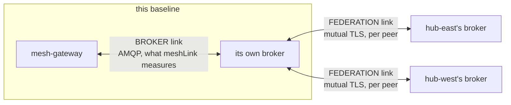

# Federation Link Visibility

How a baseline learns that its broker's links to its peers have stopped carrying traffic, and how it
tells that apart from a mesh that has merely gone quiet.

Related: [per_baseline_identity.md](per_baseline_identity.md) (broker identity, the authority, and
revocation), [mesh_broker_topology.md](../architecture/mesh_broker_topology.md) (federation, and
what a link is), [baseline_component_reporting.md](baseline_component_reporting.md) (the
infrastructure array this extends), [mesh_discovery.md](../architecture/mesh_discovery.md) (peer
liveness, which is the symptom this explains).

---

## The defect this settles

A baseline whose broker certificate has been revoked, or which presents one from an authority its
peers do not trust, **cannot learn that from its own console**. The fault is on its side and the fix
is a re-issue, so it is the one baseline that most needs to know.

Traced against the running stack, a refused baseline currently shows:

- **`meshLink: up`** - the mesh-link state is the gateway's connection to **its own** broker, and
  that broker is right there answering.
- **Artemis `UP`** on the infrastructure card, because that row renders from the same state.
- **every peer `UNREACHABLE`**, because nothing is crossing any more.

Which is indistinguishable from "every peer happened to go quiet at the same moment". We could
already tell **down** (a peer that cannot serve) from **gone** (a peer that stopped announcing) from
**cut off** (our own broker is unreachable, locked #46). **Refused is a fourth state**, and it
renders as *cut off* minus the one banner that makes *cut off* legible.

The other side needs no change: the enforcing peers show the refused baseline as `UNREACHABLE`,
which is honest, because from over there it genuinely has gone silent.

**This was never a defect in the scenarios.** `revoked-east` and `foreign-authority` both assert the
refusal at the handshake, which is the security property, and both pass. What was missing is the
operator-facing half.

---

## Two links, and why one says nothing about the other

The confusion has a structural cause: there are two independent connections and only one of them had
a name.



The **broker** link is the gateway talking to its own broker. The **federation** links are that
broker talking to peer brokers, one per peer, authenticated by certificate. A revoked certificate
breaks every federation link and touches the broker link not at all - which is exactly why the
console reported health while nothing worked.

Everything below follows from taking the second row of that diagram seriously as a thing with a
state.

---

## Decision 1: measured from the broker, per peer

**The federation state is read from the broker, not inferred from peer silence.**

The broker already holds it. On a running three-baseline stack, each broker carries one federated
queue per peer, with the peer's cluster id in the queue name and a consumer count that reflects
whether the link is live:

```
federated.lattice-mesh-hub-east.hub-east-from-hub-central.topic://lattice.mesh.announce.multicast
federated.lattice-mesh-hub-west.hub-west-from-hub-central.topic://lattice.mesh.announce.multicast
```

That is a **per-peer fact**, which is the property that decided this. The obvious cheap alternative -
inferring from "every peer aged out while my own link stayed up" - was declined on three counts: it
is mesh-wide, so it cannot fire when one peer is refused and another is fine; it is wrong in the
legitimate case where every peer really did go down together; and it reports an inference in the
shape of a measurement, which this project has consistently declined to do.

The gateway already holds an authenticated connection to its own broker, so the credential and
connectivity cost is expected to be zero. See [Risks](#risks) for the one part of that not yet
proven.

---

## Decision 2: on `Peer`, with the Artemis row derived from it

**Both surfaces, one computation.** A new optional field on `Peer` carries each peer's federation
state, and the Artemis `ComponentHealth` row reports `DEGRADED` with a detail line naming the
affected peers.

The pair is deliberate and the division of labour matches what the console already does: the Artemis
row is what makes an operator look, the peer rows are what tell them which peer. Either alone is
worse. The peer field alone is easy to miss, because a refused peer's row reads `UNREACHABLE`
whether or not the new field exists. The Artemis row alone flattens a per-peer fact into one status
plus prose, which is what a detail line is worst at.

**The Artemis row is derived from the peer states rather than probed separately.** One read, one
computation, two renderings - so the two can never disagree. A second probe would be a second
opportunity to be stale, and two surfaces disagreeing about one fact is worse than either being
absent.

`ComponentHealth` already carries `UP`/`DEGRADED`/`DOWN` plus a `detail` line, and `artemis` is
already one of its `kind` values, so **that half needs no contract change at all**. The `Peer` field
is additive and optional, so a client generated before it still validates.

---

## Decision 3: `up`, `down` and `refused`, and silence while cut off

**The states are `up`, `down` and `refused`. There is no `unknown`.**

**`refused` is computed in the gateway and read by the console, never re-derived there.** The
certificate check that distinguishes it lives in the gateway (Decision 7), so that is where the
conclusion is drawn. The alternative - two states on the wire plus a console-side derivation from
the Artemis row - was rejected on a principle this repository already holds: `ClusterVerdict`'s own
docstring records that the cluster verdict is *read, not computed*, because recomputing it would
fork the definition across two languages and let the console disagree with the baseline. Deriving
`refused` in TypeScript forks "refused" the same way, and it could only do so by matching prose in a
`detail` line - a coupling that breaks silently, in the direction of under-reporting, the moment
someone rewords a sentence. It also sits badly beside Decision 2, whose point is one computation and
two renderings.

When the gateway's own broker link is down, federation state cannot be read: the management read
travels over the connection that is gone. Rather than inventing a third state for that case, **the
field is not consulted while `meshLink` is `down`** - the mesh-link state already owns it, and the
console is already showing a banner explaining exactly that.

This follows the precedent in `baseline_component_reporting.md`, which declined to distinguish
"cannot reach it" from "it is dead" for infrastructure, matching how service readiness already
treats unreachable and broken alike.

The counterargument was weighed and is recorded rather than dismissed: `unknown` is honest in a way
that a silently retained last-known `up` is not, and quiet staleness is the exact shape of the
Micrometer gauge defect. What makes silence acceptable here is that the case is never silent on
screen - it coincides with a banner, by construction.

---

## Decision 4: the console says "Broker" and "Federation"

**Neither reading is called "mesh".**

A refused baseline's console shows a healthy broker link and broken federation at the same time, and
both are true. "The mesh link is up and the mesh is not working" is a sentence that makes an
operator distrust the screen - and the cause is that one of the two things was named after the whole
system.

So the console labels them for what they distinguish:

| Reading | What it measures |
|---|---|
| **Broker** | this baseline's gateway to its own broker (the contract's `meshLink`) |
| **Federation** | this broker to its peer brokers, per peer |

`meshLink` keeps its name in the contract, where it is accurate and where renaming it would be a
breaking change for no gain. This is a presentation decision, and it reaches the **Metrics view's
card as well**, which is renamed from "Mesh link" to "Broker" in the same change.

Collapsing both into a single "Mesh" reading was rejected: a single reading cannot say whether you
are cut off or refused, which re-creates precisely the ambiguity locked #46 exists to remove.

---

## Decision 5: a Federation column, with a tooltip per state

**The Discovered Mesh table gains a Federation column**, rendering `Up`, `Down` or `Refused` per
peer. Each value carries a tooltip explaining what it means and what to do.

Annotating the existing `UNREACHABLE` cell was the first choice and was **reversed after drawing
both**, on an argument that only appeared once they were side by side:

**Federation goes down before the peer goes unreachable.** There is a window of up to one peer
time-to-live - about 30 seconds - in which the link is dead and the peer still reads `Ready`. An
annotation living inside the `UNREACHABLE` cell has nowhere to appear during that window, so it can
only ever explain a symptom that has already arrived. A column has somewhere to put the cause
**before** the symptom, which for a signal whose whole job is "the fault is yours" is the difference
between a warning and a post-mortem.

The column also states the *absence* of the problem usefully, which the annotation cannot. A peer
that is `Unreachable` with federation `Up` - a peer whose gateway stopped while its broker kept
federating, which is the `peer-lost` scenario exactly - reads immediately as **not your problem**.
Under the annotation there was simply nothing to annotate, so an operator had to reason it out.

The costs are real and are accepted rather than argued away:

- **Permanent width** in the densest panel on screen. Measured against the real layout this is
  smaller than first assumed: the mesh panel is roughly two-thirds of the console, about 900px at a
  1440px window, so the column fits comfortably on a desktop and gets tight near 1024px.
- **A column that reads `Up` on every row almost always.** This is the sharper cost. A column that
  never changes is one the eye learns to skip, and it changes exactly once, in a table where nothing
  else has moved either. Nothing about the design fixes that; it is the price of the window above.

**Every value is explained in place.** Three tooltips, since a status word nobody can define is a
status word nobody trusts:

| Value | Tooltip |
|---|---|
| `Up` | This broker holds a live federation link to that peer, so announcements are crossing. |
| `Down` | The federation link to that peer is not carrying traffic. This baseline's certificate has not expired, but revocation cannot be checked from here - if every peer is down, check the authority. |
| `Refused` | This baseline's own certificate has expired, so peer brokers refuse the connection. Re-issue it with `issue-certs.sh`, then roll this baseline's broker. |

`Down` says what it has ruled out rather than claiming the certificate is fine, because ruling out
expiry does not rule out revocation. Naming the one check it could not make is what stops the
neutral reading being read as an all-clear.

**The tooltip must be reachable by keyboard, not only by hover.** `PanelHelp` already records why
this console prefers a dialog to a tooltip: a tooltip that vanishes on a mouse move is the wrong
container for anything worth writing down, and hover is not reachable by keyboard. A tooltip is
right here because the content is one sentence rather than three paragraphs - but the value must be
focusable (a dotted underline as the affordance, `tabIndex`, and `aria-describedby`) so the
explanation is available on a keyboard and to a screen reader. `Tooltip` is already used in this
table on the redirect control, which is focusable for the same reason.

**The direction is settled here; the exact rendering carries `needs-mockup`** until a founder
confirms it (Enforcement Rule 16).

---

## Decision 6: one activity entry, not two

**A federation transition enriches the peer's unreachable entry rather than adding a line of its
own. Log only, no toast.**

Federation dropping and the peer aging out are not two events. They are one event observed twice,
about a time-to-live apart. Two entries would make a 20-entry ring buffer read as though more had
happened than did - so the entry reads "hub-east went unreachable: federation refused" rather than
appearing twice.

No toast, which also settles by decision one of the open questions in
[activity_vocabulary.md](../ui/activity_vocabulary.md): whether every kind should toast, or only
some. This one does not, because the peer transition it enriches already interrupted once.

---

## Decision 7: report neutrally; let your own certificate sharpen it

**The link reading is neutral. The wording is sharpened only when a local fact justifies it.**

The signal is symmetric and its meaning is not. When hub-central refuses hub-east's revoked
certificate, hub-east sees "my link to hub-central is down" and hub-central sees "my link to
hub-east is down" - identical readings, opposite implications. On hub-east it means *your
certificate is the problem, re-issue it*; on hub-central it means *that peer cannot reach you, and
there is nothing here to fix*. Nothing in the queue state distinguishes them.

So the baseline checks **its own** certificate, which is a local fact needing no peer.

**How it reads it, and what that cost.** Two mechanisms were considered and both were tested rather
than assumed. Asking the broker over its management connection - the route every other read here
uses - **does not work**: measured against a running broker, Artemis's entire management surface
exposes no certificate, keystore, truststore or TLS attribute at all. Mounting a copy of the public
certificate into the gateway would work but distributes TLS material to a second pod and can
disagree with what the broker actually loaded. So the baseline **completes a TLS handshake against
its own broker and reads the certificate presented**, which needs no mount, no new material and no
chart change - and reads the live artifact, so a broker running something other than what was
deployed is visible rather than silently trusted.

**What that can and cannot establish.** A presented certificate carries its validity dates, so
**expiry is knowable**. **Revocation is not**: it lives in the authority's revocation list, which
this baseline does not hold and cannot obtain from its own broker. So:

- own certificate **expired** and federation links down -> **`Refused`**, justified rather than
  guessed
- otherwise -> **`Down`**, and mean it

The consequence is stated rather than glossed: **a revoked but unexpired certificate reads as
`Down`, not `Refused`.** That is the neutral report doing exactly what it is for - it is less
helpful than naming the cause, and it is not wrong. It also means the `Down` wording must not claim
the certificate is fine, only that it has not expired, because ruling out expiry does not rule out
revocation.

**A consequence worth stating, because it is the operator's strongest clue:** a bad certificate
breaks **every** federation link, not one. So `Refused` never appears on a single row - it appears on
all of them at once, and the pattern itself says the fault is local. A single row reading `Down`
while its neighbours read `Up` is, by construction, somebody else's problem.

It degrades gracefully: with no certificate check available this is exactly the neutral report.

Inferring blame from the pattern - all links down means it is you, one link means it is them - was
rejected, because it is wrong exactly when a baseline has a single peer.

This also covers a case the original report did not consider: a certificate that has simply
**expired** produces the identical symptom, and in normal operation is far likelier than a
deliberate revocation.

---

## Decision 8: warn before it breaks

**Proactive certificate expiry is in scope, not deferred.** Below a threshold, the Artemis row reads
`DEGRADED` with the days remaining.

Everything else in this design explains a mesh that has already stopped working. This is the only
part that prevents one. Certificates expire on a schedule - `issue-certs.sh` issues leaves at 825
days - so this will happen to every deployment eventually, on a date nobody is watching for, and the
expiry date is already in hand from Decision 7.

The threshold is a values change rather than a design commitment, which is why choosing it wrongly
first time is not an argument against building it.

---

## Decision 9: a per-peer gauge

**`lattice.mesh.federation.up`, labelled by peer cluster id.**

Cardinality is bounded by the peer count, the same bound `lattice_mesh_announcements_received_total`
already accepts, so this adds no new cardinality risk (locked #78). The value is already being
computed for the console on a poll the gateway already runs, so the marginal cost is close to zero.

The reason it earns a meter is not symmetry with the existing gauges. It is that a refused or
expiring certificate is a slow, quiet, recurring condition, and that is the class of failure a trend
serves better than a glance. It also completes the existing **Broker** card's story, which today can
read `Up` while nothing is crossing.

---

## Decision 10: the certificate scenarios assert it

**`revoked-east` gains assertions** that the refusal is visible on the baseline's own interface, and
that it recovers on re-issue.

**`foreign-authority` does not, and the reason is worth recording.** That scenario stages a foreign
keystore inside a pod and uses it for a single handshake attempt; the broker's own acceptor keeps
its genuine certificate throughout, so **no federation link is ever actually broken**. An assertion
there would be asserting nothing. This corrects the first draft of this decision, which named both
scenarios before either had been read closely - and it is a useful reminder that a test placed where
the condition does not occur is worse than no test, because it reports green forever.

This is not routine coverage. It is the mitigation for the naming risk below, and the doc says so
plainly so nobody removes it as redundant: a signal that fails **to healthy** is worse than no
signal, and a scenario running against a real broker across a real cluster boundary is the only
place the naming assumption is genuinely exercised. Unit coverage cannot catch a rename, because a
fixture is built against the same assumption the code makes.

A dedicated new scenario was declined: `revoked-east` already induces exactly this state by exactly
the means that matter, so a second would reproduce it to assert the same thing.

The assertion expects **`down`, not `refused`**, and that is the design rather than a weaker test:
the certificate is revoked but has not expired, and revocation is not knowable from a baseline. It
is the honest reading, and asserting it pins that honesty in place.

---

## Derived, not decided

Three consequences follow from decisions already locked, and are recorded here so they are not
re-litigated:

- **Never announced.** A report about a broken link cannot travel over that link (locked #46, the
  same reasoning as #43). This is doubly true here, since the link in question is the one that
  carries announcements.
- **It does not affect the announced rollup**, which stays a rollup of this baseline's own services
  (locked #43).
- **It does not affect gateway readiness.** Broker loss deliberately does not fail the gateway
  (locked #42), and federation loss is a weaker condition than that - the baseline still serves all
  of its own data.

---

## Rejected: signing the operator out

Recorded so it is not re-proposed. Operator identity (Keycloak, PKCE) and broker identity (X.509,
mutual TLS between brokers) are deliberately separate - `per_baseline_identity.md` opens on that
split. A bad broker certificate says nothing about whether someone may use the console, and signing
them out would remove the one tool that could show them what is wrong. It is the same reasoning that
keeps `mesh-gateway` readiness `UP` when its broker dies.

---

## Risks

- **The queue-naming dependency.** Reading per-peer state relies on Artemis's federated-queue
  naming, which is a broker implementation detail rather than a contract. An upgrade that renames
  those queues would make the read return nothing, and nothing reads as **healthy** - the failure
  mode this repository has already been bitten by twice, in the Micrometer gauges that went quietly
  stale and in the pre-push hook that could never pass. Decision 10 exists to make that loud.
- **Revocation is invisible locally**, so `Refused` fires on expiry alone. See Decision 7; the
  neutral `Down` reading is what covers the revoked case, and its wording says so.

**Resolved, and recorded because both answers were measured rather than assumed:**

- Artemis management **is** reachable over the AMQP head the gateway already holds - proven by
  `BrokerManagementIT`, which stays as a permanent suite because it is the only thing that would
  catch the management protocol changing on an upgrade.
- Artemis management **does not** expose anything about the broker's own certificate - measured
  across its full management surface, which carries no certificate, keystore, truststore or TLS
  attribute. Hence the handshake read in Decision 7.

---

## Deferred

- **Distinguishing "the peer's broker is down" from "the peer refused us"** beyond what the local
  certificate check yields. It needs the peer's cooperation, which Shape A deliberately does not
  have.
- **How long federation has been down**, rather than its state now - the same per-component history
  `baseline_component_reporting.md` defers, and it belongs with that work.
- **Alerting and thresholds** on the new gauge, which belong with the collection stack and therefore
  behind the hosting decision (locked #56).
- **A peer configured but never once heard from.** It has no registry entry to annotate, and it is a
  different problem: it has never worked rather than stopped working.

---

## Decisions settled here

Promoted to a numbered locked decision - see
[locked_decisions.md](../../reference/locked_decisions.md).

- Federation link state is measured per peer from the broker, never inferred.
- It rides `Peer` as an optional field; the Artemis infrastructure row is derived from those states.
- Three states, `up`, `down` and `refused`, computed in the gateway and read by the console; not
  consulted while the broker link is down.
- The console names them **Broker** and **Federation**; neither is called "mesh".
- It gets its own column, rendering `Up` / `Down` / `Refused`, each with a keyboard-reachable
  tooltip - chosen over annotating the reachability cell because federation drops a time-to-live
  before the peer does, and only a column can say so while it matters.
- One activity entry, not two; log only, no toast.
- Neutral reporting, sharpened by the baseline's own certificate state, covering expiry as well as
  revocation.
- Proactive expiry warning is in scope.
- A per-peer gauge, labelled by peer cluster id.
- The two certificate scenarios assert it, which is what keeps the naming dependency honest.
