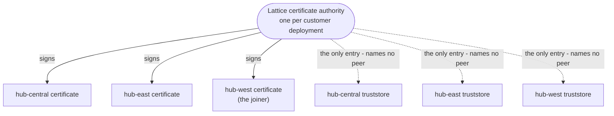

# Per-baseline Identity - Keycloak, Protected APIs, and Broker Certificates

How an operator is authenticated, what that buys them, and what happens when they cross a baseline boundary. Settles the build shape of locked #38 (per-baseline Keycloak) and resolves the broker-identity question locked #45 deferred.

Related: [cluster_interop.md](../architecture/cluster_interop.md) (Shape A redirect + the auth-across-the-redirect section), [interop_console.md](interop_console.md) (the console surface this protects), [mesh_broker_topology.md](../architecture/mesh_broker_topology.md) (broker federation, whose credential this replaces), [api_structure.md](../architecture/api_structure.md) (the `/api/v1` surface), [locked_decisions.md](../../reference/locked_decisions.md) (#37 Shape A, #38 per-baseline Keycloak, #42 sole mesh participant, #44 federation topology, #45 shared federation credential, #47 downstream authorization).

---

## The principle

**Identity belongs to the baseline that owns the data.** This is the same rule Shape A applies to orders: a baseline owns its data, so it owns the decision about who may see or change it. Nothing about identity crosses the mesh, for the same reason nothing about work does.

Two consequences run through everything below. An operator working across several baselines holds an account on each. And a baseline can never be locked out, or let in, by a decision made somewhere else.

---

## Two identities, deliberately separate

This document covers two things that are easy to conflate and must not be:

|                      | Operator identity                         | Broker identity                |
|----------------------|-------------------------------------------|--------------------------------|
| Who is authenticated | A human, to a REST API or the console     | A broker, to another broker    |
| Mechanism            | Keycloak, OpenID Connect, JSON Web Tokens | X.509 certificates, mutual TLS |
| Granularity          | Per user, by role                         | Per baseline                   |
| Where it is enforced | Each service's `/api/v1`                  | The Artemis federation link    |

They share a principle (identity is per-baseline) and nothing else - no code, no configuration, no library. They are designed together here because #45 pointed the broker question at "the per-baseline identity work", and are **built separately** because coupling them would put two unrelated mechanisms behind one QA gate.

---

## Operator identity

### The realm

Each baseline runs **its own Keycloak** with **its own realm** (#38). The realm defines:

| Object | Value       | Grants                                                                                |
|--------|-------------|---------------------------------------------------------------------------------------|
| Role   | `viewer`    | Every `GET` under `/api/v1`                                                           |
| Role   | `operator`  | Everything `viewer` has, plus the writes: create order, set stock, create reservation |
| Group  | `viewers`   | The `viewer` role                                                                     |
| Group  | `operators` | The `operator` role                                                                   |

Users are managed by **group membership**, not per-user role edits, so access is granted and revoked in one place.

Two roles rather than three: the line that matters is who can change state. Nothing in the current system is admin-only - there is no user-management or configuration surface exposed over `/api/v1` - so an `admin` role would grant exactly what `operator` does until such a surface exists. Per-service scoped roles (`orders:write`, `inventory:write`) were considered and rejected as premature: no requirement exists for someone to hold writes on one service while being denied them on another.

### The same vocabulary everywhere, different membership

**Every baseline's realm defines the same role and group names, with the same meaning.** A token is therefore interpretable no matter which baseline issued it, the console's authorization logic is identical everywhere, and a future move to realm brokering becomes a role mapping rather than a translation problem.

**Membership is per-baseline and deliberately unsynchronized.** No baseline can see another's user directory, and no identity data crosses the mesh. Being `operator` at home and `viewer`, or absent entirely, on a peer is the system working correctly, not a fault to correct.

This is a real constraint, not an oversight, and it follows from the architecture:

- Requiring matching membership would mean baselines synchronizing user directories, reintroducing precisely the cross-baseline coupling Shape A removes.
- There is no mechanism to do it without realm-to-realm brokering, which #38 defers.
- Baselines are independently operated (#12, #14), so each one's operators decide who reaches it. A peer overriding that would be the anomaly.

**The accepted cost:** an operator working across N baselines needs N grants. A redirect can legitimately land someone on a login they cannot pass - see [the redirect landing](#the-redirect-landing) below.

### What is protected

**Every `/api/v1` operation on every service** - orders, inventory, and mesh-gateway alike - requires a valid token from that baseline's realm, carrying a role sufficient for the operation.

**`/health` and `/readiness` stay unauthenticated.** Kubernetes probes cannot present a token, and gating them would take healthy pods out of rotation on a configuration mistake - trading a real availability risk for no meaningful secrecy, since a probe reports only whether a process is up.

The rule is uniform across services deliberately: there is nothing service-specific to remember, and no endpoint whose protection depends on which service happens to serve it. In particular the mesh-gateway's `getPeers` and `getBaseline` **are** protected, because a cluster's topology, health, and endpoint list is operational detail, not public information.

### Client and token shape

| Party          | Keycloak client | Mechanism                                                                                                |
|----------------|-----------------|----------------------------------------------------------------------------------------------------------|
| Status console | Public          | Authorization Code with PKCE                                                                             |
| Every service  | Bearer-only     | Validates the JSON Web Token signature against its own realm's JWKS endpoint, then checks the role claim |

The console is a **public** client because no secret can be kept in a browser; PKCE is what makes that safe. Services hold **no session state** and make **no Keycloak call per request** - signature validation against the cached JWKS is local, so a Keycloak outage does not stop an already-issued token from working.

Token validation uses **`vertx-auth-oauth2`**, the Vert.x-native OpenID Connect support, per the one-engine-per-job rule (#15). No second security framework is introduced.

A backend-for-frontend holding a confidential client was considered and rejected: it would add a new component in front of every console request, which the baseline does not otherwise need. Direct grant (username and password posted to the token endpoint) was rejected outright - it puts credentials through the application and forfeits Keycloak's own login page, multi-factor, and brute-force protection.

### Realm provisioning

The realm, its roles, groups, and client are defined by a **committed realm import JSON**, mounted into the container and imported at start. Version-controlled, reviewable in a diff, and identical on every run.

> **The same trap as the broker configuration.** Import runs **only when the realm does not already exist**. A persisted Keycloak database would silently ignore edits to the import file, exactly as a persisted Artemis instance ignored `etc-override`. Locally, Keycloak therefore runs in **dev mode with no external database and no persistence**, so the import always applies.

#### A deployed baseline persists (locked #72)

A deployed baseline cannot run this way: dev mode holds everything in memory, so every operator account and every session is lost on each pod restart. It therefore sets `keycloak.devMode: false`, which switches Keycloak to `start` against **its own MySQL** - deployed by the chart, or an existing database named by `keycloak.database.host`.

Keycloak cannot use this baseline's Elasticsearch; it supports relational databases and nothing else. That is why locked #7's single-datastore rule is scoped rather than broken: Elasticsearch remains the only store for **Lattice** data, and **no Lattice service holds a connection** to the identity database.

Three consequences follow, and each is handled in the chart rather than left to be remembered:

| Consequence                                                                                  | Why it matters                                                                                                                                                                                                                                                                                                                                                                | How it is handled                                                                                                                                                                                                                 |
|----------------------------------------------------------------------------------------------|-------------------------------------------------------------------------------------------------------------------------------------------------------------------------------------------------------------------------------------------------------------------------------------------------------------------------------------------------------------------------------|-----------------------------------------------------------------------------------------------------------------------------------------------------------------------------------------------------------------------------------|
| **The import file stops being the source of truth** once a realm exists                      | The trap above, now live: an edit to the committed realm is silently ignored                                                                                                                                                                                                                                                                                                  | The pod's realm-checksum annotation is **dropped in persisted mode**, because rolling the pod would skip the import and report an ignored change as applied. Changing an imported realm is an **admin operation, not a redeploy** |
| **Production mode disables plain HTTP** (`http-enabled` defaults false, on only in dev mode) | Every in-cluster caller reaches Keycloak over plain HTTP - services fetching signing keys, the gateway's identity probe, both health probes - so the switch to `start` would take identity down while Keycloak reported healthy                                                                                                                                               | `KC_HTTP_ENABLED=true`, with TLS terminated in front of Keycloak                                                                                                                                                                  |
| **Keycloak exits rather than retries** when its database is unreachable at boot              | The pod crash-loops through MySQL's first-start initialisation, reporting the ordinary case as a fault                                                                                                                                                                                                                                                                        | An init container waits for the database, the same gate a data-owning service puts in front of Elasticsearch                                                                                                                      |
| **An interrupted schema migration is unrecoverable on MySQL**                                | Production startup runs a Quarkus build and the Liquibase migration - about 77 seconds for one baseline, longer when several start together. MySQL's DDL is non-transactional, so a migration killed part-way does not roll back and every later start fails on the inconsistent schema (`Unknown column 'COUNTER' in 'CREDENTIAL'`). The database must be dropped to recover | A **startup probe** on `/health/started` suspends the readiness and liveness probes until Keycloak reports started, with a deliberately generous 10-minute threshold: waiting costs a slow rollout, being wrong costs the schema  |

**Verified** on a persisted baseline: realm signing keys are byte-identical across a pod restart (in dev mode they regenerate, invalidating every issued token), a user and password credential created before the restart survive it, authentication succeeds afterwards, and the start log reads `Realm 'lattice' already exists. Import skipped`.

Manual admin-console setup was rejected as unreproducible and unreviewable - the reliable way for two baselines to end up subtly different. A provisioning script against the admin API was rejected as code to maintain, needing admin credentials at run time, for what the import file achieves declaratively.

### The redirect landing

An operator following a Shape A redirect from baseline A arrives at baseline B's console root (#37). B has no session for them, so **B's Keycloak authenticates them against B's realm** (#38). For the minimum viable product this is a full re-authentication; there is no cross-baseline single sign-on.

Three outcomes, all of which the console must handle:

| On arrival                                | What happens                                                                                                                                                                                                             |
|-------------------------------------------|--------------------------------------------------------------------------------------------------------------------------------------------------------------------------------------------------------------------------|
| Already signed in to B                    | Proceeds straight to B's console                                                                                                                                                                                         |
| Has an account on B, no session           | B's Keycloak login, then B's console                                                                                                                                                                                     |
| **No account on B, or insufficient role** | Authentication fails or authorization is denied. **This is expected**, not an error state to hide: B's operators decide who reaches B. The console says so plainly and points the operator back to where they came from. |

The third row is the most likely first contact an operator has with per-baseline identity, and it must not read as a bug in the federation.

### What this means for the unified view

The unified view aggregates every discovered baseline (#37), and per-baseline auth would appear to empty it: an operator signed in to A holds no session on B, so a read of B's API returns 401.

It does not, because the view never makes that read:

| Layer                                                                                                              | Source                                                           | Auth                                                                      |
|--------------------------------------------------------------------------------------------------------------------|------------------------------------------------------------------|---------------------------------------------------------------------------|
| **Health and identity** of every peer - rollup, region, baseline version, reachability, `consoleUrl`, `apiBaseUrl` | The operator's **own** gateway registry, populated from the mesh | The operator's session on **their own** baseline. No peer session needed. |
| **Detail** for one peer - its orders, its inventory                                                                | That peer's own console, reached by the redirect                 | A session on **that** baseline                                            |

So **every peer always appears, always with its health**, whether or not the operator can sign in to it. Detail requires going to the owner - which is Shape A's model regardless of auth: act on the baseline that owns the data.

**This is where locked #61 came from.** #37 originally had the browser live-pull each peer's `apiBaseUrl` for that detail layer, and the reasoning above is what killed it: the pull cannot authenticate, and no amount of cross-origin configuration changes that. Membership is deliberately unsynchronised, so the operator may hold no grant on that peer at all, and a fan-out returns 401 from every one of them. The clause predates this identity model and did not survive it.

Cross-origin allowance is still needed, but for a nearer reason: this baseline's own console, orders, inventory and gateway are served on separate addresses, so the console's own reads are already cross-origin.

---

## Broker identity

### The problem #45 left open

Every baseline's broker currently authenticates federation with **one shared credential** (#45), so a leak cannot be traced to a baseline, and revoking it means rotating every broker in the environment.

The obvious fix - give each baseline its own broker user - **breaks locked #44**. Artemis authorizes a downstream federation command by mapping a user to a role, so a per-baseline user must be authorized on every existing broker. That is an edit to every existing broker when a new baseline joins, destroying the no-edit-on-join guarantee #44 exists to provide and the two-baseline local stack demonstrated. This unsolved tension is why #45 was deferred rather than decided.

### The resolution: trust a certificate authority, not a peer

**Each baseline presents its own X.509 certificate, signed by a shared Lattice certificate authority. Brokers trust the authority, not individual peers.**

This preserves the guarantee because the trust anchor **names nobody**, exactly like today's generic role. A joining baseline's certificate is accepted by every existing broker with no edit, no restart, and no redeploy, because each broker was only ever configured to trust the authority that signed it.

The property is easiest to see by asking what changes when hub-west arrives: **one new certificate, and nothing else.** No truststore gains an entry, because none of them ever held a peer. The alternative - each broker trusting each peer directly - would need every existing truststore edited on every join, which is the quadratic cost locked #44 exists to avoid, arriving by a different route.

It runs in reverse too, which is what makes revocation cheap: a revoked baseline is refused by updating the enforcing broker's revocation list, with **no edit to the revoked baseline's own cluster**. The `revoked-east` scenario asserts exactly that.

What it buys over the shared credential:

- **Traceable identity.** Each baseline connects under its own distinguished name, so federation activity is attributable in the logs.
- **Individual revocation.** A compromised baseline's certificate is revoked at the authority; peers reject it via the revocation list, with no peer edits and no rotation of anyone else's credential.
- **Encryption in transit.** Mutual TLS also closes "transport security between brokers", listed as deferred in `mesh_broker_topology.md`.

### The limitation, stated plainly

**Authorization stays a single generic role.** Artemis's certificate login modules (`TextFileCertificateLoginModule`, `ExternalCertificateLoginModule` - both present in the pinned 2.44) map a specific distinguished name to a user and role. Granting *different* permissions per peer would mean naming each peer's distinguished name in every broker's configuration, which is edit-on-join again by another route.

So a certificate answers **"which baseline is this, and is it one of ours?"** - not **"what may this particular baseline do here?"** Every authenticated baseline gets the same federation permissions.

That is sufficient: federation is symmetric by design (#44), every baseline publishes and consumes the same announce address, and no requirement exists for one baseline to grant a peer more or less than another. Differentiated per-peer authorization is deferred, and would need a mechanism that does not exist today.

### Cost

A certificate authority; per-baseline issuance; Artemis SSL acceptors and truststores; local development certificate generation; certificate distribution as Kubernetes Secrets; and rotation before expiry. This was real work, comparable in size to the whole of operator identity, which is why it was built separately from operator identity rather than alongside it. It is built: `deploy/certs/issue-certs.sh` is the tool, and both refusal cases - a revoked certificate and one from an authority nobody trusts - are asserted by scenarios rather than argued for here.

---

## Configuration surface

New environment variables, all read through the shared config loader and declared in the Helm chart (`deploy/k8s/chart`), in the values of the component that reads them:

| Variable                | Read by                | Meaning                                                                                                                                                                                   |
|-------------------------|------------------------|-------------------------------------------------------------------------------------------------------------------------------------------------------------------------------------------|
| `KEYCLOAK_URL`          | every service, console | This baseline's own Keycloak base URL, as a token's issuer claims it. Single-valued: a service never addresses a peer's Keycloak, for the same reason it never addresses a peer's broker. |
| `KEYCLOAK_INTERNAL_URL` | every service          | Where a service *reaches* Keycloak, when that differs from the address above. Optional; unset means the two are the same.                                                                 |
| `KEYCLOAK_REALM`        | every service, console | This baseline's realm name                                                                                                                                                                |
| `KEYCLOAK_CLIENT_ID`    | console                | The public client the console authenticates as                                                                                                                                            |

> **Why the issuer and the address are two settings.** A token is issued to a browser through a published address and validated by a service that reaches Keycloak over the internal network, so in any containerized deployment those are different strings for the same realm. The issuer to *trust* must be the one tokens actually carry; the address to *fetch signing keys from* is wherever this service can reach. Collapsing them into one setting forces a choice between a service that cannot fetch keys and an issuer check that rejects every legitimate token. Keycloak's own `hostname-backchannel-dynamic` exists for the same reason.

Broker certificate paths and truststore configuration land with that build ticket, not here.

---

## Scope

### In scope now (the narrowed identity ticket)

- A Keycloak per baseline, deployed by the chart into that baseline's own cluster.
- The committed realm import: roles, groups, client, and the local demo operator.
- Bearer-token validation on every `/api/v1` operation in orders, inventory, and mesh-gateway; probes left open.
- The environment variables above, declared in the chart.

### In scope, folded into the console tickets

The console half cannot be built before the console exists, so it becomes a **requirement on the status-console skeleton and interop-console tickets** rather than a ticket of its own: the PKCE login flow, attaching the token to API calls, the signed-out state, and the redirect-landing outcomes above.

> **Mockup gate (Enforcement Rule 16).** Both of those tickets already carry `needs-mockup`. Their mockups must now also cover the **signed-out state** and the **"redirected to a peer where you have no access"** screen. That second screen is the most likely first contact an operator has with per-baseline identity, and a mockup set showing only the signed-in happy path leaves the screen that explains the architecture ungated. Golden-section proportions for both, per `docs/design/ui/`, are part of that confirmation.

### In scope as its own build ticket

Broker identity: the certificate authority, per-baseline certificates, Artemis mutual TLS, and rotation - as designed above.

### Deferred

- **Realm-to-realm brokering / cross-baseline single sign-on.** Deferred by #38 and unchanged here. It is the one thing that would remove the N-grants cost.
- **Differentiated per-peer broker authorization.** No mechanism today that preserves no-edit-on-join.
- **Per-service scoped roles**, multi-factor authentication, and token-lifetime tuning.
- **Keycloak high availability.** Persistence itself is **no longer deferred** - a deployed baseline runs `start` against its own MySQL (locked #72, above). What remains open is running more than one Keycloak replica: the Deployment is still `replicas: 1`, so a pod restart is a brief identity outage rather than a seamless failover. The database is the precondition for fixing that, not the fix.
- **Service accounts for server-side calls.** None are needed: the only server-side cross-service call is the mesh-gateway polling `/readiness`, which is unauthenticated.

---

## Decisions settled here

- Operator identity and broker identity are **separate mechanisms** sharing only a principle; designed together, built apart.
- Each baseline's realm defines **`viewer` and `operator` roles** with `viewers` / `operators` groups; membership is managed by group.
- **All `/api/v1` is protected on every service; `/health` and `/readiness` are not.**
- The console is a **public client using PKCE**; services are **bearer-only**, validating against their own realm's JWKS via `vertx-auth-oauth2`.
- The realm is provisioned by a **committed import file**; Keycloak runs **dev-mode and unpersisted** locally so the import always applies, and **persists to its own MySQL when deployed**, where the import file stops being the source of truth for a realm that already exists.
- **Role and group names are standard across every baseline; membership is deliberately unsynchronized.** An operator across N baselines needs N grants, and a redirect may land on a login they cannot pass.
- The unified view shows **every peer's health from the operator's own registry**, and per-peer **detail only with a session on that peer**.
- **One Keycloak per baseline, including locally** - shared local infrastructure would stop the stack modelling the topology.
- Broker identity is **a per-baseline certificate signed by a shared Lattice certificate authority**, with mutual TLS; **authorization remains a single generic role**, because per-peer authorization reintroduces edit-on-join. This **resolves #45**.

Promoted to locked decisions - see [locked_decisions.md](../../reference/locked_decisions.md) #48, #49, #50.
