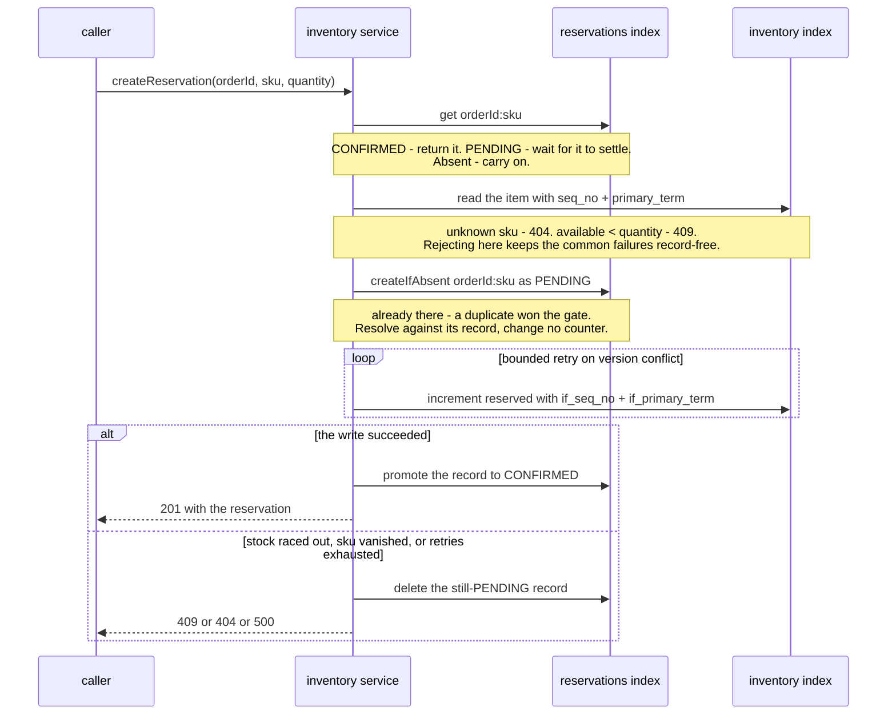
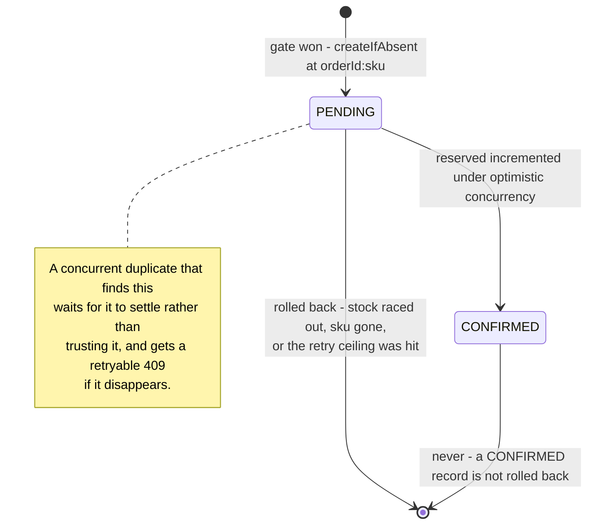

# Inventory service

The second Lattice Vert.x microservice. Owns stock levels and reservations for its own cluster: set stock per item, read availability, and reserve stock against an order line, persisted to Elasticsearch, described by the versioned `/api/v1` REST contract. Grounds ticket #7.

Under Shape A federation (locked #37) each baseline owns its own data; inventory is single-cluster and local (no mesh, no auth wiring yet). It is a **standalone** service - the automatic orders -> inventory reservation flow is a separate later ticket; this ticket ships the directly-callable reserve endpoint.

Related: [orders.md](orders.md) (the sibling service + shared patterns), [api_structure.md](../architecture/api_structure.md) (envelope + error taxonomy), [data_model.md](../architecture/data_model.md) (index-per-entity + aliases + bootstrap), [service_protocol.md](../../protocol/service_protocol.md) (thin routes, the data layer, enforce-invariants-at-the-data-layer), [example_domain.md](../../reference/example_domain.md), [locked_decisions.md](../../reference/locked_decisions.md) (#17 OpenAPI, #19 strict bodies, #32 per-service ES model, #35 response envelope, #37 Shape A, #39 logging).

---

## Scope (MVP, #7)

A standalone, local slice - stock + oversell-safe reservations:

- **Set stock** for an item (absolute on-hand).
- **Get availability** for an item.
- **Reserve** stock against an order line (the deliverable), oversell-safe and idempotent.
- Reuse the shared runtime (`BaseVerticle`, `EsRepository`) and the orders patterns (envelope, error classifier, logging).

Everything else is out of scope ([Deferred](#deferred-post-mvp)).

---

## REST contract (`/api/v1`)

Three operations added to the OpenAPI v1 spec. Standard `{data|error, meta}` envelope; strict request bodies (locked #19), lenient responses.

| Operation                             | operationId         | Success                                 | Errors                                                            |
|---------------------------------------|---------------------|-----------------------------------------|-------------------------------------------------------------------|
| `PUT /api/v1/inventory/{sku}`         | `setStock`          | **200** `{ data: InventoryItem, meta }` | 400, 409 (`onHand` < `reserved`)                                  |
| `GET /api/v1/inventory/{sku}`         | `getInventory`      | **200** `{ data: InventoryItem, meta }` | 404 `NOT_FOUND`                                                   |
| `POST /api/v1/inventory/reservations` | `createReservation` | **201** `{ data: Reservation, meta }`   | 400, 404 (unknown sku), 409 (insufficient / idempotency conflict) |

Any operation returns **503 `UNAVAILABLE`** when Elasticsearch is unreachable (reusing the orders cause-chain classifier); `/readiness` reports `DOWN` until ES is reachable.

### `setStock` - `SetStockRequest` (strict)

```json
{ "onHand": 100 }
```

`onHand` required, integer `>= 0`. Sets the item's on-hand to the absolute value (creates the item if absent, `reserved = 0`). If the new `onHand` would be **less than the current `reserved`** (available would go negative), reject with **409 `CONFLICT`**. Written under optimistic concurrency (below).

### `getInventory` -> `InventoryItem`

```json
{ "data": { "sku": "sku-42", "onHand": 100, "reserved": 12, "available": 88 },
  "meta": { "requestId": "...", "apiVersion": "v1" } }
```

`available = onHand - reserved`, computed at read (never stored). An unknown sku is **404 `NOT_FOUND`**.

### `createReservation` - `CreateReservationRequest` (strict)

```json
{ "orderId": "b3f1c2a8-...", "sku": "sku-42", "quantity": 3 }
```

| Field      | Type          | Rule             |
|------------|---------------|------------------|
| `orderId`  | `ShortString` | required         |
| `sku`      | `ShortString` | required         |
| `quantity` | integer       | required, `>= 1` |

Reserves `quantity` of `sku` against the order line `(orderId, sku)`. Response - `Reservation`:

```json
{ "data": { "reservationId": "9c1f...-uuid", "orderId": "b3f1c2a8-...",
            "sku": "sku-42", "quantity": 3, "createdAt": "2026-07-24T00:00:00Z" },
  "meta": { "requestId": "...", "apiVersion": "v1" } }
```

New spec schemas: `SetStockRequest`, `InventoryItem`, `InventoryItemResponse`, `CreateReservationRequest`, `Reservation`, `ReservationResponse` - reusing `ShortString` and the shared error responses (incl. the existing `Conflict` 409).

---

## Reservation semantics (oversell-safe + idempotent)

The correctness core of the service.

**Identity + idempotency.** A reservation is keyed by the order line **`(orderId, sku)`** - the reservations document id is `"<orderId>:<sku>"`. A repeat reserve for the same `(orderId, sku)`:

- same `quantity` -> **no-op**, returns the existing reservation (no second increment). Safe under at-least-once client retries.
- different `quantity` -> **409 `CONFLICT`** (a changed reservation is not the same request).

**Oversell prevention (optimistic concurrency).** Reserving increments the item's `reserved` counter under Elasticsearch optimistic concurrency:

The reservation record is the **atomic idempotency gate** (a single-document create-if-absent), so the item counter is incremented **exactly once per order line** - a concurrent duplicate cannot double-count `reserved`. The record carries a **`status` lifecycle** (`PENDING` -> `CONFIRMED`) so the counter and the record - two documents with no shared transaction - stay consistent for a concurrent reader:

1. **Fast-path idempotency:** get the reservation by id `(orderId:sku)`. `CONFIRMED` -> return it (or 409 on quantity mismatch); `PENDING` (a gate winner is still holding stock) -> wait for it to settle (below); absent -> proceed.
2. **Pre-check availability (no write yet):** read the `inventory` item with its `seq_no` / `primary_term`. Unknown sku -> **404 `NOT_FOUND`**; `available (= onHand - reserved) < quantity` -> **409 `CONFLICT`** (insufficient). Rejecting here keeps the common failures record-free (no rollback).
3. **Atomic gate:** mint the reservation (server `reservationId` + `createdAt`) and `createIfAbsent` the record `PENDING` at id `orderId:sku`. If it already exists (a concurrent duplicate won the gate) -> resolve against its record (`CONFIRMED` -> return it, `PENDING` -> wait for it to settle), **no counter change**. If created -> this call exclusively owns the order line.
4. **Hold the stock under optimistic concurrency** (the only place `reserved` is incremented): read the item with `seq_no`, increment `reserved`, write with `if_seq_no` / `if_primary_term`; on a version conflict re-read and retry, bounded. On success -> **promote the record to `CONFIRMED`** (committed, safe for a reader to trust). If stock raced out, the sku vanished, or the retry ceiling is exceeded -> **roll back (delete the still-`PENDING` record)** and fail (409 / 404 / 500).



Two documents, no shared transaction - that is the whole difficulty, and it is why the gate and the counter are separate steps. The **reservations** index is where exactly-once is decided; the **inventory** index is where oversell is prevented. Neither alone is sufficient: the gate cannot hold stock, and optimistic concurrency cannot tell a retry from a new request.

The record's own states, and the edge that deliberately does not exist:



This guarantees `available >= 0` under concurrent reserves (a racing counter write conflicts and re-reads) **and** exactly-once counting per order line (only the gate winner increments).

**The edge that does not exist is the point of the diagram.** `CONFIRMED` has no path back, which is what makes it safe for a second caller to trust: only a still-`PENDING` record is ever deleted, so a reader can never observe a reservation that is about to vanish.

**Post-gate rollback edge (closed by the `PENDING` -> `CONFIRMED` lifecycle).** The counter and the record are two documents, and Elasticsearch has no multi-document transaction, so a naive "return any existing record" reader could observe a record the gate winner is about to delete on a post-gate rollback (a phantom success). The lifecycle closes it: **only a `CONFIRMED` record - a state never rolled back - is returned as a committed reservation**, and only a still-`PENDING` record is ever deleted. A reader that observes a `PENDING` record **waits for it to settle** (a bounded re-read until it becomes `CONFIRMED` or disappears) rather than trusting it; a rolled-back or still-unsettled record surfaces a retryable `409` instead of a phantom. So a concurrent duplicate never observes a reservation that is then removed. (This is stronger than the earlier accepted-MVP simplification, which deferred the fix.)

---

## Data model (Elasticsearch)

Per locked #32 and [data_model.md](../architecture/data_model.md). **Two single-writer mappings in `platform/lattice-common`** (the service never defines or mutates them); both `dynamic: strict`, provisioned create-if-absent on startup via `EsRepository`.

**`inventory`** (document id = `sku`):

```json
{ "dynamic": "strict",
  "properties": {
    "sku":      { "type": "keyword" },
    "onHand":   { "type": "integer" },
    "reserved": { "type": "integer" } } }
```

**`reservations`** (document id = `"<orderId>:<sku>"`):

```json
{ "dynamic": "strict",
  "properties": {
    "reservationId": { "type": "keyword" },
    "orderId":       { "type": "keyword" },
    "sku":           { "type": "keyword" },
    "quantity":      { "type": "integer" },
    "createdAt":     { "type": "date" },
    "status":        { "type": "keyword" } } }
```

`status` is the reservation lifecycle (`PENDING` while the gate winner is still holding stock, `CONFIRMED` once committed); it is persisted only (the wire `Reservation` never carries it - the service projects the stored record to the response, dropping `status`).

`available` is not stored (computed `onHand - reserved` at read). Both indices sit behind their read/write aliases (`inventory` / `inventory-write`, `reservations` / `reservations-write`).

---

## Code shape

Mirrors orders; reuse over rebuild.

```
services/inventory/
  pom.xml                              depends on lattice-common + lattice-contract
  src/main/java/io/lattice/inventory/
    MainVerticle.java                  thin bootstrap: deploy InventoryVerticle
    InventoryVerticle.java             extends BaseVerticle; routes + an ES readiness check
    routes/InventoryRoutes.java        thin handlers: validate -> service -> envelope
    service/InventoryService.java      set-stock + availability + reserve (idempotency + OCC retry)
    repository/InventoryRepository.java extends EsRepository; two-index bootstrap; get/index with seq_no/if_seq_no
  src/test/java/io/lattice/inventory/  contract + integration tests (vertx-junit5 + Testcontainers ES)
  Dockerfile                           provisional eclipse-temurin:21-jre base
```

- **`InventoryVerticle extends BaseVerticle`** - contributes its routes + an Elasticsearch readiness check (reuse the orders pattern, including the 503 dependency-unavailable classifier for the failure handler).
- **`InventoryRepository extends EsRepository`** - bootstraps both the `inventory` and `reservations` indices from the `lattice-common` mappings; exposes get-with-version and conditional index (`if_seq_no`/`if_primary_term`) for the optimistic-concurrency reserve. The optimistic-concurrency primitive is added to `EsRepository` (shared) or wrapped here; keep the single-writer-of-mappings rule intact.
- **`InventoryService`** - the reserve loop (idempotency check, availability check, OCC increment with bounded retry, reservation record), set-stock (absolute, reject-below-reserved), and availability read. Business logic only; no Vert.x web types.
- **DTOs** (`InventoryItem`, `Reservation`, `SetStockRequest`, `CreateReservationRequest`) are records in `platform/lattice-contract`.
- **Logging** per locked #39 (SLF4J + Logback): INFO on set-stock + reserve (a significant business event: `reserved sku={} qty={} order={}`), WARN on an insufficient/conflict reject at DEBUG (expected client outcome) - follow the orders levels.

---

## Testing (test-first)

Integration against a real Elasticsearch (Testcontainers), contract-validated, written before the implementation:

- **setStock** - sets `onHand`, creates the item if absent, returns the item; setting below `reserved` -> 409.
- **getInventory** - returns `{ onHand, reserved, available }`; unknown sku -> 404.
- **reserve happy path** - reserves against `(orderId, sku)`, decrements availability, returns the reservation; the reservation doc + the item counter both persist.
- **insufficient stock** -> 409 `CONFLICT`; **unknown sku** -> 404.
- **idempotency** - a repeated reserve for the same `(orderId, sku)` returns the same reservation and does not double-increment `reserved`; a differing quantity -> 409.
- **reservation lifecycle** - a completed reserve leaves a `CONFIRMED` record; a duplicate that observes an in-flight `PENDING` record never returns it as a committed reservation (no phantom), and a duplicate that observes a `CONFIRMED` record returns the idempotent hit. Under real concurrency, N identical duplicates all settle to the one `CONFIRMED` reservation (the waiting duplicate reads it once the winner confirms).
- **concurrency** - N concurrent reserves against limited stock never oversell (`available` never negative; only as many succeed as stock allows) - assert the settled invariant, not a mid-race snapshot ([core_protocol timing-dependent rule](../../protocol/core_protocol.md#timing-dependent--nondeterministic-behavior)).
- **readiness** - `/readiness` DOWN until ES reachable; ES-down request -> 503 `UNAVAILABLE`.
- Contract tests assert responses validate against the OpenAPI v1 schema.

---

## Deferred (post-MVP)

- **Release / cancel** a reservation (return reserved stock).
- **Restock / shrinkage** delta adjustments (vs the absolute set).
- **Listing reservations**, and filters on the stock listing. The paged **stock list** is no longer deferred: `listInventory` returns a page sorted by sku, taking a page size and a position (locked #65). Reservations have no listing operation, so they remain reachable only by the order line that created them.
- **orders -> inventory auto-reserve** flow (an order placement triggering a reservation) - the cross-service wiring.
- **Low-stock / availability signals**.
- **Mesh participation** - none here; discovery is the mesh-gateway's job and nothing local crosses the mesh. ~~**Real auth** (Keycloak).~~ **Closed by locked #48**: every `/api/v1` operation on this service is bearer-protected against this baseline's own realm.

---

## Decisions settled here

- Standalone inventory service: `setStock` + `getInventory` + `createReservation`; local REST + Elasticsearch, no mesh, no real auth.
- `InventoryItem { sku, onHand, reserved, available(computed) }`; `Reservation { reservationId (server UUID), orderId, sku, quantity, createdAt (UTC) }`.
- Reservation keyed by `(orderId, sku)` (reservations doc id); idempotent (repeat returns existing, quantity mismatch -> 409).
- Oversell-safe via optimistic concurrency (`if_seq_no`/`if_primary_term`) + bounded retry; `available >= 0`; insufficient -> 409.
- Absolute `setStock`; reject below `reserved` (409).
- Two single-writer mappings (`inventory`, `reservations`) in `lattice-common`, `dynamic: strict`; the reservation record is the atomic idempotency gate (record-first), so the counter is incremented exactly once per order line. The record carries a `PENDING` -> `CONFIRMED` `status` lifecycle: a reader trusts only a `CONFIRMED` record and waits for a `PENDING` one to settle, and only a still-`PENDING` record is ever rolled back - closing the post-gate rollback edge (a duplicate never observes a since-removed reservation).
- Reuse `BaseVerticle` + `EsRepository`; DTOs in `lattice-contract`; SLF4J+Logback (#39); provisional `eclipse-temurin:21-jre` Dockerfile.

This spec is an instance of locked **#32** (per-service Elasticsearch data model) and the REST contract (#17/#35); it introduces no new locked decision.
