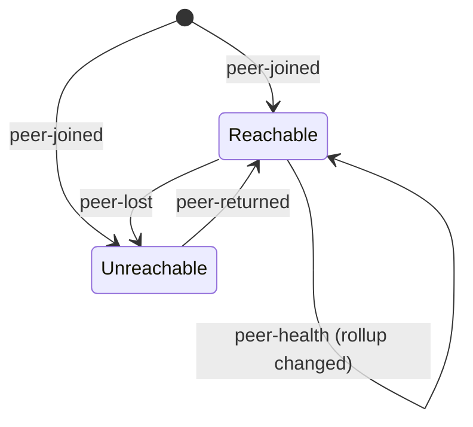
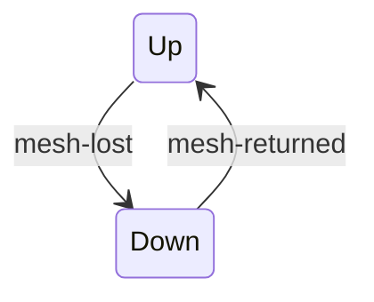
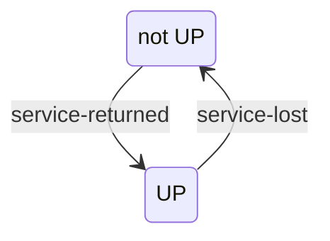
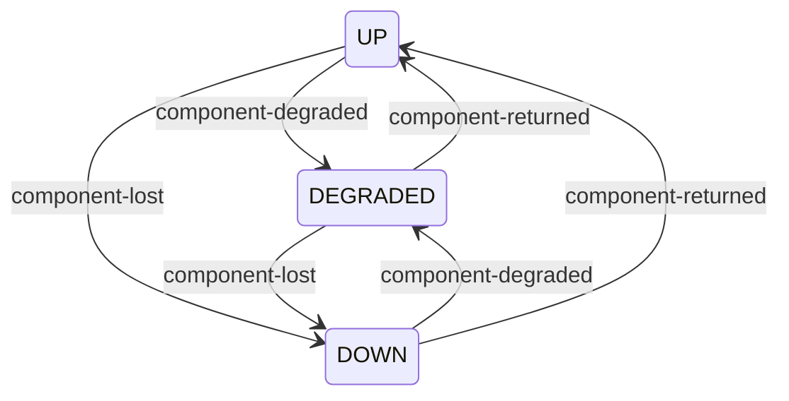

# The activity vocabulary

What the console's activity surfaces can say, and the rules that decide how each line is drawn.

The activity log and its toasts are the console's only record of what **changed**, as opposed to what **is**. Every other surface answers the present tense: the verdict, the service rows, the infrastructure card and the peer table all render the current reading and forget the last one. This is the one place that compares two polls and reports the difference, which makes its vocabulary the console's only account of an incident as it unfolded.

Related: [_index.md](_index.md) (the visual direction and the colour rules this inherits), [live_status_transport.md](live_status_transport.md) (the polling that produces the two snapshots), [baseline_component_reporting.md](../features/baseline_component_reporting.md) (the component states the local half reads), [locked_decisions.md](../../reference/locked_decisions.md) (#46 the mesh-link state, #62 Material UI, #63 the 3:1 status bar, #66 infrastructure reporting).

**This document is the vocabulary and its rules, not a second copy of the map.** The mechanical detail - which glyph, which palette path, the exact wording - lives in `ui/status-console/src/features/activity/` and `src/theme/tone.ts`, and is pointed at rather than restated. A copy would drift the first time a kind was added.

---

## The eleven kinds

| Kind | Scope | What produces it | The sentence | Glyph | Tone |
|------|-------|------------------|--------------|-------|------|
| `peer-joined` | mesh | A baseline the registry has never held appears, at whatever reachability | `<peer> joined the mesh` | add-circle | success |
| `peer-lost` | mesh | A known peer goes from reachable to not | `<peer> went quiet` | cloud-off | error |
| `peer-returned` | mesh | A known peer goes from not reachable to reachable | `<peer> came back` | check-circle | success |
| `peer-health` | mesh | A peer that stays reachable changes its rollup | `<peer> went <was> to <now>` | by landing | by landing |
| `mesh-lost` | mesh | This baseline's own link to its broker drops | `Broker link down - peer data is last-known` | link-off | warning |
| `mesh-returned` | mesh | That link comes back | `Broker link restored` | link | success |
| `service-lost` | local | A service on this baseline leaves `UP` | `<service> went down` | error | error |
| `service-returned` | local | A service on this baseline reaches `UP` | `<service> came back` | task-alt | success |
| `component-degraded` | local | A component lands on `DEGRADED` | `<component> degraded` | warning-amber | warning |
| `component-lost` | local | A component lands on `DOWN`, or on a state this console does not recognise | `<component> went down` | do-disturb-on | error |
| `component-returned` | local | A component lands on `UP` | `<component> recovered` | verified | success |

A component's own `detail` is appended to its sentence when it sent one, after a spaced hyphen, and omitted entirely when it did not - so `degraded` never trails a dangling dash. `detail` is the component's reading in **its own system's vocabulary**, which is the point of it: `DEGRADED` alone does not say which of Elasticsearch's several meanings applies.

**`peer-health` is the one kind drawn by where it landed rather than by its name.** Every other kind names its own outcome, so one glyph and one tone cover it. A rollup change does not: "went ready to degraded" and "went down to ready" are the same kind and opposite news. It therefore carries the state it landed in, and borrows the status vocabulary the rest of the console already speaks rather than keeping a fourth set of glyphs for the same three words. The consequence is deliberate: a rollup landing on `ready` shares its shape with other good news, and the sentence beside it is what tells them apart - which is what rule 1 asks of every line anyway.

Defined in `activity.ts` (`TransitionKind`, `SCOPES`, and the sentences), `TransitionIcon.tsx` (`GLYPHS`), and `tone.ts` (`toneForTransition`).

---

## The scope split, and why both halves share one timeline

Every kind belongs to exactly one half of the screen: **`mesh`** for what happened out there, **`local`** for what happened here. The log tags each line with that scope - "mesh" or "this baseline".

Scope is **derived from the kind, never stored on the transition**. The kind already determines it, so a second field would be one fact in two places, drifting the first time a kind was added and its scope was not. It is a keyed record over the closed union rather than a switch, so adding a kind without answering the question fails to compile - where a switch would need a default clause, and a default here is precisely the silent wrong answer: it would file an unclassified kind under one half of the screen without anyone deciding it belonged there.

**The two halves share one timeline rather than splitting into two panels.** An operator reading about Keycloak dying and a peer going unreachable is usually reading about one incident, and two panels would separate the two halves of it by exactly the amount that makes the connection hard to see. Ordering within a poll is mesh first, then local.

---

## What produces what

Four subjects are compared between polls, each with its own small state machine. The kind names the **edge**, not the state.

### A peer

A first sighting is `peer-joined` whatever its reachability - it was not here to return. `peer-health` fires **only while the peer stays reachable**: an unreachable peer's health is a memory, and reporting a memory as a change would invent an event nobody observed.

### This baseline's mesh link

**This edge replaces the peer comparison rather than joining it.** A cluster cut off from its broker hears nothing, so its registry ages every peer out at the same moment; reported naively that is one toast per baseline, for baselines that are almost certainly fine and talking to each other - the console blaming its peers for its own outage. While the link is down, peer transitions are suppressed entirely, for the same reason: a blind cluster has no evidence about anyone.

### A service on this baseline

Anything that is not `UP` is down rather than an unknown third thing - a readiness this console does not recognise is still not readiness.

### An infrastructure component

**The kind is chosen by where the component landed, not by where it came from.** Recovering from degraded and recovering from down are the same news, and an operator reading the line cares what is true now. This is why three states produce three kinds rather than six. A state this console does not recognise lands on `component-lost`, because baselines are versioned independently and guessing upward would report a component as fine on the strength of not understanding it.

---

## The rules

**1. Colour is never the sole indicator.** Every line carries its colour, its glyph, **and its sentence**. This is the console-wide rule, and it is what bounds the measured cost of the 3:1 status-colour bar: the word carries the meaning for an operator who cannot resolve the hue. All eleven glyphs differ, and a test enforces that rather than trusting it to review.

**2. Shape separates "out there" from "in here" before the scope tag is read.** The mesh kinds reach for clouds and links; this baseline's own half uses the plain failure and recovery marks. A severed link and a quiet peer get deliberately different shapes for the same reason the wording differs - "we are cut off" and "they are gone" are different incidents, and this is the panel where they sit side by side.

**3. Tone follows the landing state, and weight is deliberate rather than uniform.** The two "lost" kinds are not the same weight: a peer going quiet is one baseline's problem and reads as an error, while losing this baseline's own mesh link is a warning about what the screen can still be trusted to say. A degrading component is a warning rather than an error because it is still serving, and colouring "lost a replica" the same as "cannot serve" spends the console's loudest signal on the state that has not stopped anything.

**4. One tone source.** `toneForTransition` returns a **palette path**, never a colour, so the active mode resolves it and no colour is written outside the theme. A second copy of that mapping is a defect rather than a variant, because the two drift the first time a status colour is tuned - and on a status console two surfaces disagreeing about what `degraded` looks like is a correctness problem.

**5. The glyph is decorative to assistive technology.** The sentence beside it already says everything the glyph does, and announcing both would say it twice.

---

## What deliberately produces nothing

Silence is designed here, not incidental. Four cases produce no entry and no toast:

- **The first poll.** There is no previous state to have changed from, and announcing every peer on page load is a wall of toasts describing no change at all - which teaches an operator to dismiss them unread, exactly when the next one matters.
- **An unchanged state.** A subject whose reading is identical between polls produces nothing, so a healthy baseline's timeline stays empty rather than accumulating confirmations.
- **Every peer, while the mesh link is down.** Covered above: a blind cluster has no evidence about anyone. **This suppression never reaches the local half** - this baseline has complete evidence about itself, since the baseline read never leaves the cluster, and silencing local events while the mesh is down would blank the half of the screen that still works at exactly the moment it is being read.
- **A service or component appearing for the first time.** Unlike a peer, whose arrival is a discovery, these are a configured list: a new name means the deployment changed, and reporting it would announce a rollout as an incident.

Two caps bound the surfaces rather than the vocabulary: the log holds the most recent entries of the session and the toasts show only the last few, both defined in `useActivity.ts`. Neither decides what may be said.

---

## Known deviations

None. Two were recorded here when this document was written, and both have since been fixed:

- **`peer-health` drawn as a warning whatever the peer landed in**, so a baseline recovering to `ready` rendered identically to one falling to `down`. It is now drawn by its landing state, described in the table above.
- **Toast severity as a second, incomplete mapping**, which named only the six mesh kinds and defaulted all five local ones to `info` - so a service going down toasted blue while the same event was red in the log beneath it. Severity now derives from the one shared tone mapping.

**This section stays, empty, rather than being deleted.** It is where the next departure is recorded, and an absent section would have to be re-invented by whoever finds one - along with the reasoning for why a rules document names its own violations.

---

## Open

- **Whether every kind should toast at all**, or only some. The log is the durable record and the toast is the interruption, so the two surfaces need not carry the same eleven. Today they do, by inheritance rather than by decision.
- **The vocabulary has no wording for a peer whose baseline version changed**, which is a rollout on another cluster rather than an incident. It is deliberately silent today; whether that is right is untested against a real upgrade across baselines.
