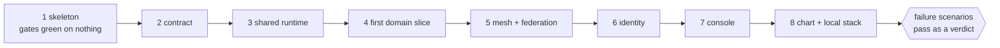

# Lattice - Replication Prompt

**How to use this pack.** Give your LLM (or your team) all three documents of this pack, then say "build this":

1. **This document** - the mission, the ground rules, the build order with an acceptance check per stage, and the pinned-stack manifest.
2. **[System Requirements Document](system_requirements.md)** - the numbered shall statements the finished system is verified against.
3. **[External API document](external_api.md)** - the exact wire: every REST shape, the mesh envelope, and the federation link.

The three are self-contained: nothing in them requires this repository. Where they name the original's choices (package namespace, cluster names), substitute your own; where they pin a version, section "The stack manifest" says what the pin protects so you can substitute knowingly. The repository's own `orders` and `inventory` services are a demonstration domain and are **deliberately not part of this pack**: you will build your own domain on the platform instead.

Everything below this line is the prompt.

---

## Mission

Build **Lattice**: a mesh of independent microservice clusters. Each **service** is a Java 21 / Vert.x 5 application in its own Docker container. All services of one deployment run in one Kubernetes cluster; that collection is the versioned **baseline** (versioned services plus versioned REST endpoints that ship together). Each cluster owns its own Elasticsearch data model, which may diverge from its peers'. Separate clusters discover each other and advertise their endpoints over an Apache Artemis backed **mesh**; nothing else ever crosses it (no shared schema, no cross-cluster reads or writes, no work handoff). Acting on a peer means being redirected to that peer's own **status console**, a React single-page app shipped one-per-cluster, signing in against that peer's own identity realm.

The System Requirements Document (SRD) is binding: every **shall** statement must hold in the finished system. The External API document is the wire: a system serving those interfaces exactly is interoperable with the original.

## Ground rules

These are working rules for the build itself, distilled from what the original learned the hard way. The SRD states the product requirements; these state how to get there without repaying the original's detours.

1. **Test-first.** Write the failing test that captures the behavior, show it fail, then implement to green. The one documented exception: an Elasticsearch mapping cannot be queried before it exists, so mapping work carries its specification-driven integration tests in the same change. Say so when you use the exception.
2. **Contract before either side.** No REST shape or mesh envelope exists outside the contract module. The OpenAPI document drives server validation and generates the console client; when they would disagree, the contract is edited first and both sides follow.
3. **Reuse over rebuild.** Before writing any class, verticle, or component, look for the shared one and extend or configure it. Every service extends the shared base verticle; every service reads the datastore through the shared repository base; the console reuses its shared components on every panel. A parallel "lean" copy of something that exists is a defect, not initiative.
4. **One engine per job.** One JSON codec, one HTTP client, one logging facade, one styling engine, versions managed centrally. Before adding a dependency, check whether the stack already solves the job; prefer the toolkit-native option.
5. **Derive, never re-declare.** When a value is needed in a second place, derive it from the first declaration (the image tag from the baseline version, the realm's redirect addresses from the console address). Every defect class of the original's configuration had the same shape: a second declaration that drifted.
6. **When a check can fail toward good news, check the check.** A lint that silently stops matching passes everything forever and reads as health. Self-test gates against planted fixtures; give scenario scripts a control asserting the healthy pre-state before they break anything.
7. **Verdicts are computed where the evidence is, and rendered everywhere else.** The gateway rolls up health; the console displays it. The gateway concludes "refused"; the console displays it. Recomputing a judgement in a second place (or a second language) forks its definition.
8. **No blocking on the event loop, all time in UTC, no secrets in code or logs.**

## What is deliberately yours to decide

The pack under-specifies these on purpose; decide them and record your decision:

- **The domain.** Choose your own. Build at least one data-owning domain service end to end (SRD VER-002) following the vertical-slice stage below; the platform does not care what it models.
- **Naming.** Package namespace, group id, cluster and region names, the branding of the console.
- **Product surface the original never designed:** the console's theme selection and motion system existed in the original only as code. Design your own or omit them.
- **Seed data** for local development, per your domain. Making it differ per baseline is worth copying: it demonstrates that divergent data models really are tolerated.

## The build order

Eight stages. Two constraints fix the order: the module dependency graph (a module cannot compile before what it imports), and the gate set (quality gates adopted on an empty reactor cost nothing; adopted on a full one they cost a sweep of every file). Each stage closes on an acceptance check you can run, because a stage that closes on judgement is a stage you will re-open.

### Stage 1 - The skeleton, and every gate green on nothing

The parent aggregator `pom.xml` (packaging `pom`), the Maven wrapper, a tracked scope-aware pre-push hook, the continuous-integration workflow, and every quality gate of SRD QUA-001, all before a single line of application code. Two calibrations are cheap only now: any build-failing style rules you adopt (the original bans a punctuation character this way), and the coverage floors, which must count integration coverage and therefore must skip when integration tests are skipped, or your fast local gate can never pass.

> **Acceptance:** `./mvnw verify` passes on a reactor with no modules, and enabling the hook makes a push run it.

### Stage 2 - The contract module

The versioned seam, single-writer. First because both sides of every later wire depend on it: the OpenAPI 3.1 document drives router validation and generates the console's client, so it can follow neither. Author the document to the conventions of External API document section 2 (envelope, error taxonomy, pagination, strict request bodies, document-level security) and the platform operations of section 3; add the mesh envelope records of section 7.

> **Acceptance:** the module builds; unit tests pin every operation shape and envelope record; the TypeScript generator produces a client from the document without error.

### Stage 3 - The shared runtime module

The stage that decides whether reuse-over-rebuild is structural or aspirational. The base verticle (configuration, `/health`, `/readiness`, the `/api/v1` guard mount point, graceful shutdown, the management port); the shared configuration loader; the Elasticsearch client and repository base with index-per-entity, read and write aliases, and bootstrap-from-committed-mapping; the mesh client and peer registry (nothing calls them until stage 5). Make a service that wants its own health endpoint have to go out of its way.

> **Acceptance:** a Testcontainers-backed integration suite bootstraps every index from its committed mapping and reads a document back through the alias.

### Stage 4 - The first domain slice

One service of **your** domain, end to end: a base-verticle subclass, a thin router mounting operations claimed from the contract, a service layer no web type leaks into, a repository over the shared base, a Dockerfile on the shared base image, and both test layers. This is where "routes are thin" becomes testable, and where you find out whether stage 2's document was complete, because a request that should have been rejected and was not is a specification gap.

> **Acceptance:** `./mvnw verify` green with a route contract test (a web client against the deployed verticle asserting both the success and the error envelope) and a Testcontainers integration test against real Elasticsearch.

### Stage 5 - The mesh, and federation across brokers

The mesh-gateway service, one Artemis broker per baseline, and address federation between brokers. Implement discovery exactly per External API document section 7 (announce on startup, heartbeat, and change; time-to-live liveness derived on read; unreachable peers retained) and federation per section 8 (joiner declares both directions; `max-hops="1"`; mutual TLS against a shared authority; a shared federation role for authorization). Three facts about Artemis are measured, not designed, and each cost the original a detour: the announce address must be addressed as a **topic** or the broker load-balances announcements and each peer sees a fraction of the mesh; there is **no** `downstream-authorization` attribute in the broker schema, so authorization is ordinary broker security; and broker management exposes **nothing** about the broker's own certificate, so reading its expiry means completing a TLS handshake against it.

> **Acceptance:** two baselines discover each other from a cold start, and a loop check measures one hop at the broker.

### Stage 6 - Identity

Keycloak per baseline, the realm imported from a committed file whose redirect addresses derive from the console address, and the `/api/v1` guard implemented in the base verticle: bearer-only validation against the realm's cached key set, two roles, probes and docs left open. Gating in the shared base rather than per service converts a rule you must remember into one you cannot break.

> **Acceptance:** an unauthenticated `/api/v1` call returns 401, a token missing the grant returns 403, both probes still answer without one, and a peer realm's token is refused.

### Stage 7 - The status console

React with Vite and TypeScript, its own container, its own gate set (it is not a Maven module, so the reactor's gates do not cover it). The client is generated from the contract, never hand-declared. The console renders verdicts and never computes them. Views: the cluster verdict with its per-service and infrastructure breakdown, the unified mesh view rendered from this baseline's own registry with a redirect action per peer, Broker and Federation as two named links that are never called "mesh", and the metrics view over the guarded contract operation. Sign-in is authorization-code with Proof Key for Code Exchange.

> **Acceptance:** the console's own verify script passes (lint, types, tests with coverage, dead-code and token checks), and the generated client compiles against the current contract.

### Stage 8 - The chart, the local stack, and the scenarios

The Helm umbrella chart (a subchart per component over a mandatory library chart, `enabled` flags, one authored source for every variable) and a stack script creating three local kind clusters, one baseline each, with image build, deploy, seed, per-service redeploy, and the failure scenarios of SRD DEP-010. The compile happens inside the image-build path so a built image can never carry a stale jar.

> **Acceptance:** the chart lint renders every baseline and passes its own fixture self-test; three baselines come up, federate, and all failure scenarios pass as a verdict.

## The stack manifest

The original's pins, and what each pin protects. Substituting a newer version is fine **when you preserve the alignment the pin exists for**; the right-hand column is the part that must survive substitution.

| Component            | Original pin      | What the pin protects                                                                     |
|----------------------|-------------------|--------------------------------------------------------------------------------------------|
| Java                 | 21                | One long-term-support runtime, enforced by the build (fail outside the major)             |
| Maven                | 3.9.x via wrapper | The wrapper pins the build tool per checkout; no system Maven required                    |
| Vert.x               | 5.1.x             | Imported as a bill of materials so every toolkit artifact moves together                  |
| JUnit                | 5.14.x            | Imported as a bill of materials                                                           |
| Testcontainers       | 2.0.x             | Its Elasticsearch image tag must equal the deployed server tag                            |
| Elasticsearch client | 8.19.x            | Client, test image, and deploy image all derive from one version property                 |
| Jackson              | Vert.x-managed    | Pinned to what the toolkit manages so the datastore client's copy converges               |
| SLF4J / Logback      | 2.0.x / 1.5.x     | One logging pipeline; the facade pinned to what the binding pulls                         |
| Micrometer registry  | matches core      | The one metrics artifact the toolkit's bill of materials does not manage, so it can drift |
| Node.js / pnpm       | 24 / declared     | Console toolchain travels with the repository (`.nvmrc`, `packageManager`)                |
| React / Material UI  | 19.x / current    | One component library, one styling engine (Emotion), one theme file                       |
| TanStack Query       | current           | The data seam unit tests mock at                                                          |
| keycloak-js          | current           | The public PKCE client                                                                    |
| openapi-typescript   | current           | Generates the console client from the contract document                                   |
| Artemis image        | 2.44.x            | The broker schema stage 5's measured facts were verified against                          |
| Keycloak image       | 26.x              | Dev-mode locally, persisted against MySQL when deployed                                   |
| Base service image   | `eclipse-temurin:21-jre` | Shared by every service; declares a numeric user for `runAsNonRoot`               |

Convergence is enforced, not hoped for: turn on dependency-convergence enforcement so a transitive version fork fails the build rather than resolving quietly.

## What you must author, not derive

These artifacts are sources in the original: no document generates them, and none of this pack's prose will either. Author each; its acceptance check tells you when yours is equivalent rather than merely similar.

| Artifact                        | Acceptance check                                                                                                  |
|---------------------------------|--------------------------------------------------------------------------------------------------------------------|
| The OpenAPI contract document   | Router mounts every claimed operation with no unmatched-operation warning; the generated client compiles          |
| The quality-gate configurations | The reactor is green; a planted violation of each gate fails the build                                            |
| The broker configuration        | Two brokers federate; the loop check measures one hop                                                             |
| The realm import file           | A console at the configured address signs in; any other address is refused with an invalid-redirect error         |
| The umbrella chart              | The chart lint renders every baseline, self-tests green, and flags no duplicate variable or missing security context |
| The stack script                | Create, images, deploy, seed produce three federating baselines; every failure scenario passes                    |
| The certificate tool            | Three baselines federate over mutual TLS; a revoked and a foreign-authority certificate are each refused          |
| The pre-push hook and CI workflow | A code change runs the gates; a docs-only push runs nothing; a red CI run blocks the merge                      |

## Done

The build is finished when SRD section 12 holds: every stage's acceptance check has passed in order, your domain slice exists end to end, three local baselines survive the full failure-scenario set, and the external interfaces conform to the External API document in full. The scenarios are the acceptance check for the whole system, not a demonstration: each asserts the healthy pre-state first and turns a failed assertion into its exit status.
