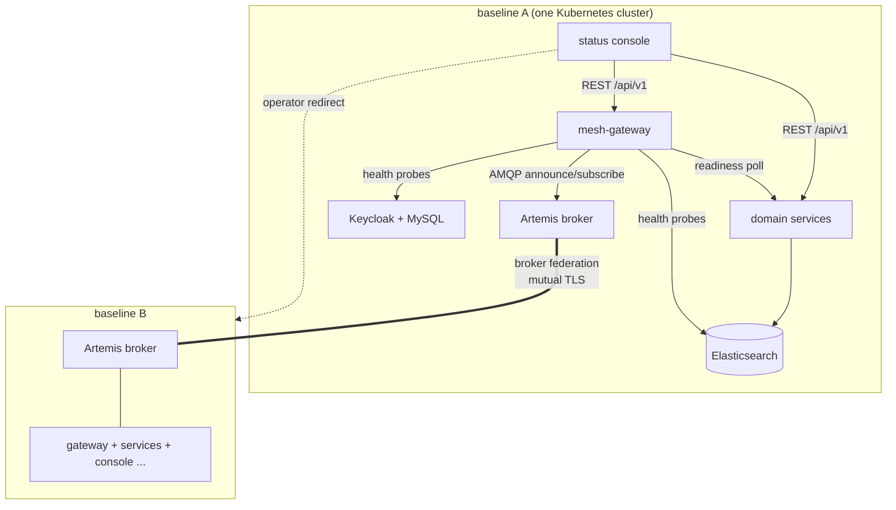
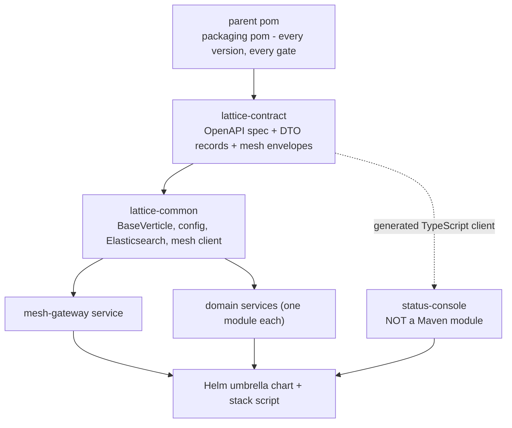
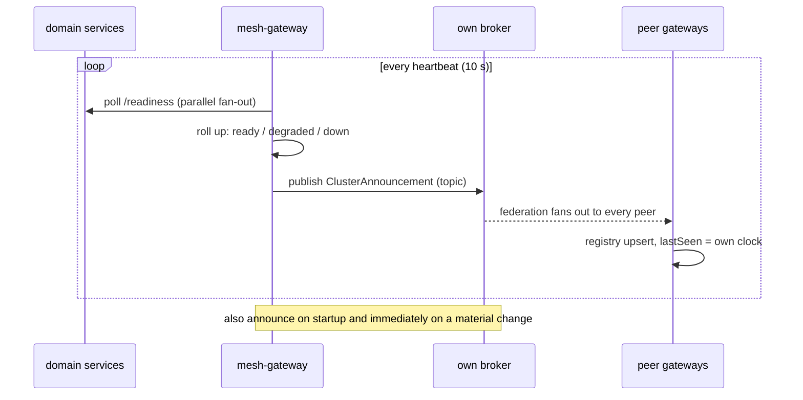

# Lattice - Software Design Document (SDD)

Part of the [replication pack](replication_prompt.md), alongside the [System Requirements Document](system_requirements.md) and the [External API document](external_api.md). Those two state what must hold and what is served; this document explains the shape that satisfies them: the decomposition, the responsibilities, the key mechanisms, and the rationale behind the choices a rebuilder would otherwise plausibly "fix" back.

**This document is deliberately self-contained.** It is written to be handed to a builder (human or LLM) who does not hold this repository. Inside the repository, the canonical sources remain the design docs under `docs/design/`, the protocols under `docs/protocol/`, and [locked_decisions.md](../reference/locked_decisions.md); if this document ever disagrees with them, they win and this document is the defect.

**Scope exclusion.** The repository's `orders` and `inventory` services are a demonstration domain and are excluded. Where a mechanism is best seen in a domain service (a repository, a strict write operation), it is described as the pattern any domain service follows.

---

## 1. Architectural overview

### 1.1 The system in one paragraph

Lattice is a mesh of independent clusters. Each **baseline** is a versioned set of Java 21 / Vert.x 5 services, one Docker container each, running in one Kubernetes cluster with its own Elasticsearch datastore, its own Artemis broker, its own Keycloak realm, and its own React status console. Baselines discover each other over federated brokers and exchange exactly one thing: an announcement of identity, health, and endpoints. Everything else - data, work, identity - stays with the baseline that owns it, and acting on a peer means being redirected to the peer's own console.

### 1.2 Runtime topology

What the diagram deliberately omits is the design's central negative: there is **no** edge from any service in baseline A to any store, service, or realm in baseline B. The only inter-baseline edges are the broker federation link and the operator's own browser.

### 1.3 The principles that explain most choices

1. **Ownership over sharing.** Data, identity, and data models belong to one baseline. Interoperability is achieved by redirecting people, not by translating or moving data (Shape A federation).
2. **Structural enforcement over remembered rules.** The API guard lives in the shared base verticle, the trust anchor is a certificate authority rather than a peer list, environment separation is a handshake failure rather than a convention. A rule you cannot break beats a rule you must remember.
3. **Derive, never re-declare.** A value needed twice is derived from its one declaration: image tags from the baseline version, realm redirect addresses from the console address, the broker infrastructure row from the federation states.
4. **Verdicts are computed where the evidence is** and rendered everywhere else. The gateway rolls up health and concludes "refused"; the console only displays both.
5. **The wire stays O(1).** The announcement is a fixed six-field record; per-service and infrastructure detail is served locally and never announced, so the mesh does not grow with the system.
6. **When a check can fail toward good news, check the check.** Lints self-test against fixtures; scenarios open with a control asserting the healthy pre-state.

---

## 2. Module decomposition

A single Maven multi-module reactor, plus one deliberate outsider.

| Module             | Single responsibility                                                                                              | Why it cuts here                                                                                                  |
|--------------------|---------------------------------------------------------------------------------------------------------------------|--------------------------------------------------------------------------------------------------------------------|
| parent pom         | Version and gate authority: every shared version, every quality gate, dependency convergence.                       | Gates adopted here bind every module from its first line; a version pinned here cannot fork per module.           |
| `lattice-contract` | The versioned seam: the OpenAPI document, every REST data transfer object, every mesh envelope record. Single-writer. | Both sides of every wire depend on it, so it can follow neither; single-writer because a forked wire is not a wire. |
| `lattice-common`   | Everything every service must not reimplement: base verticle, config loader, health, guard, data layer, mesh client. | Reuse is structural only if the shared thing exists before its consumers.                                          |
| service modules    | One deployable service each: thin routes, a service layer, a repository. The gateway is the only structural one.    | The container is the unit of deploy, scale, and version, so the module is the unit of build.                       |
| `status-console`   | The per-baseline operator view.                                                                                      | Deliberately outside Maven: its inner loop stays at Vite speed and its toolchain in its own manifests.             |
| `deploy/`          | The chart (one release = one baseline), the certificate tool, the local three-cluster stack script.                 | Configuration is a product surface with one authored source, not an afterthought per environment.                  |

The dotted edge is the one worth pausing on: the console depends on the contract but no build system enforces it. The edge is held by a generator script (OpenAPI to TypeScript) plus the console's own gate, which makes Java-to-Java drift impossible and Java-to-TypeScript drift merely detectable - the reason the console has a gate set of its own.

---

## 3. Component designs

### 3.1 The shared runtime (`lattice-common`)

**Responsibility:** be the reason a service is thin.

- **`BaseVerticle`** - every service extends it. It loads configuration, mounts `/health` and `/readiness`, mounts the bearer guard over all of `/api/v1`, serves the documentation pages, owns the management (metrics) port, and handles graceful shutdown. A service that wants its own health endpoint has to go out of its way, which is the point.
- **Configuration loader** - one component reads the SCREAMING_SNAKE_CASE environment into typed config; no service calls the environment directly. Every variable is declared, with a description, in the chart values of the component that reads it - the chart is the single authored source of configuration.
- **Bootstrap helper** - constructs the shared `Vertx` instance. It exists because metrics options must be set at `Vertx` construction, which `BaseVerticle` (deployed *into* a `Vertx`) structurally cannot reach; without it that block was copied per service.
- **Startup resilience** - a retrying gate wraps dependency bootstrap: a service started before its broker or datastore joins or bootstraps on its own when the dependency appears, and a failed bootstrap retries rather than memoizing the failure.
- **The API guard** - bearer-only validation against the realm's cached key set, mounted once in the base for every service. A request arriving before signing keys are cached is paused, not drained, so the first authenticated write after a cold start does not fail.

### 3.2 The contract module (`lattice-contract`)

**Responsibility:** be the only place a wire shape exists.

- The OpenAPI 3.1 document drives the Vert.x router's request validation on the service side and generates the console's typed client - one source, two enforcement points.
- Data transfer objects and mesh envelopes are immutable records; closed variant sets are sealed types. Request schemas are strict (unknown keys rejected, every string and array bounded); response schemas are lenient so additive fields never break an older client.
- **Per-service narrowing:** a service declares the operations it owns, and the served document is narrowed to them plus the probes - so no service advertises an operation it would answer 404 for. The probes are mounted directly (not through the OpenAPI router) and added back to the published document, because every service serves them but none "owns" them.

### 3.3 The data layer (`lattice-common`, `es/`)

**Responsibility:** one way to touch Elasticsearch.

- A shared repository base carries the client, the timer and error counter instrumentation, and the query patterns; a domain service's repository extends it and adds only its own operations.
- **Index-per-entity with read and write aliases.** All access goes through the aliases, so a mapping can evolve by reindex-behind-alias without breaking readers. Bootstrap creates each index from its committed mapping on startup and applies additive mapping updates to an existing index in place.
- Automatic index creation is disabled at the cluster: a premature write to an unknown target once invented an index carrying an alias's name, permanently blocking that service's bootstrap. The seed refuses to run early *and* Elasticsearch refuses to invent, closing the defect at both ends.
- Indices set `auto_expand_replicas: "0-1"`: a single node is genuinely green (not reinterpreted yellow), a multi-node cluster regains replica redundancy, and yellow keeps its meaning where it has one.
- **Data jobs** (seed, reindex, reset) run from the already-built service image by overriding the container command, guarded so they cannot run against the wrong target - maintenance uses the same artifact that serves.

### 3.4 The mesh-gateway

**Responsibility:** be the cluster's only mesh participant - one announcement stream, one registry, one rollup.

- **Announcer:** publishes the fixed six-field `ClusterAnnouncement` on startup, on the heartbeat, and immediately on a health flip or version change. The heartbeat is the liveness signal; there is no separate ping.
- **Peer registry:** in-memory only - it is derived state that peers re-announce every heartbeat, so persistence would buy little and add a dependency. Liveness is derived on read from `lastSeen` (receiver's own clock, so peer clock drift cannot fake liveness); a peer past the time-to-live flips to `UNREACHABLE` but is retained with its last-known snapshot, because a vanished row cannot be told apart from one that was never there.
- **Health rollup:** the gateway polls the readiness of the services named in its configured list and rolls them into one label. The gateway lists itself in the local breakdown but stays out of the rollup, since its own readiness deliberately cannot fail.
- **Infrastructure probes:** Elasticsearch cluster health (green/yellow/red mapped to UP/DEGRADED/DOWN), Keycloak's own readiness (probed on a management endpoint that stays reachable when not ready), and the broker row **derived** from the federation link states rather than probed separately - so the two readings cannot disagree.
- **Mesh-link state and federation measurement:** the gateway reports its own broker connection (`meshLink`) and, per peer, the broker's federation link, read from the broker's federated queues. `refused` is concluded in the gateway by checking its **own** certificate's expiry - read by completing a TLS handshake against its own broker, because broker management exposes nothing about the certificate and a mounted copy could disagree with what the broker loaded.
- **Deliberate availability choice:** the gateway's readiness stays UP when the broker is unreachable, so the console keeps serving an honest degraded view instead of nothing - a report about a broken link cannot travel over that link, and taking the reporter down with the fault repeats the mistake.

### 3.5 The broker topology

**Responsibility:** carry announcements between independent baselines without coupling them.

- One Artemis broker per baseline, joined by **address federation, not clustering**: federation is built for independent brokers in separate administrative domains at differing versions, which is what baselines are, and clustering's discovery relies on multicast that does not cross pod or site boundaries.
- Federation covers exactly one address (the announce topic) with `max-hops="1"`, so a federated message is never re-federated - loop prevention that is measured by a scenario, not assumed.
- **The joiner pays the cost:** a joining baseline declares both upstream and downstream connections to each peer, so an existing baseline is never edited, restarted, or redeployed when the mesh grows. No broker configuration names a trusted peer.
- **Identity is a certificate, trust is the authority.** Per-baseline X.509 certificates signed by a shared authority, mutual TLS between brokers. Trusting the authority rather than peers is what preserves no-edit-on-join; revocation removes one baseline without touching any other; and separate authorities per environment make a development broker structurally unable to federate onto production. Authorization stays one generic shared role, because mapping specific distinguished names to roles would be edit-on-join by another route.

### 3.6 Identity

**Responsibility:** authenticate operators to the baseline that owns the data, and nothing wider.

- One Keycloak realm per baseline, provisioned from a committed import file whose redirect addresses **derive** from the configured console address - a console served anywhere else is refused by the realm itself.
- Two roles with matching groups: `viewer` (every read) and `operator` (reads plus writes). Names are standard across baselines so a token is interpretable anywhere; **membership is deliberately unsynchronized**, because synchronizing it would recreate exactly the cross-baseline coupling the architecture removes. An operator on three baselines holds three grants, and a redirect may legitimately land on a login they cannot pass - a documented cost, not a defect.
- The console is a public client using authorization-code with Proof Key for Code Exchange; services are bearer-only against the realm's cached key set, so an identity-provider outage does not invalidate issued tokens.
- Locally Keycloak runs dev-mode and unpersisted (so realm-file edits always apply, since import only runs when the realm is absent); deployed it persists in its own MySQL - infrastructure's own store, which no platform service ever connects to - with a startup probe guarding schema migration, because a migration killed part-way on non-transactional DDL is data loss, not delay.

### 3.7 The status console

**Responsibility:** render what the baseline knows; decide nothing.

- React + Vite + TypeScript, one container per baseline with its API addresses baked in at build time; Material UI as a full replacement component library with Emotion as the only styling engine and one theme file as the only place a colour may be written (gate-enforced).
- **Renders verdicts, never computes them:** the rollup, the federation conclusion, and every judgement are read from the API. The one exception is arithmetic over registry fields (the mesh rollup count). Recomputing a verdict in the browser would fork its definition across two languages.
- The unified mesh view renders every peer from this baseline's **own** registry; the browser never fans out to peer APIs (each would refuse this realm's token anyway). Acting on a peer is a redirect action on that peer's row.
- Two links, two names: **Broker** (this baseline to its own broker) and **Federation** (broker to each peer, with per-peer up/down/refused). Neither is called "mesh" - naming one link after the whole system is what once made a healthy reading read as a healthy mesh.
- Live status is a 10-second poll, measured as the right trade: staleness is dominated by the 30-second peer time-to-live, so a push transport would buy back only the smaller quarter of the latency budget while adding a second credential path a browser cannot cleanly carry.
- Failure surfaces are honest and specific: an unreachable peer dims and stays with its age; a failed read says whether it is retrying and annotates rather than blocks views without forms; an ended session says why; a viewer's missing grant disables controls with the reason named rather than hiding them, because the same person may hold the grant on a peer.

### 3.8 Observability

**Responsibility:** measure the platform without widening its attack surface.

- Micrometer with a Prometheus registry, served at `/metrics` on a dedicated management port, ClusterIP only, never the API port - an unauthenticated scrape surface must never ride a port a browser reaches.
- Instrumented: the runtime families from the toolkit binding, nine mesh and rollup meters placed with the state they report, and a timer plus error counter in the repository base. HTTP metrics are labelled by route template, never raw path, so identifiers cannot enter the metric surface; gauge registration is re-registration-safe because the metrics engine otherwise keeps a replaced owner's meter alive reporting stale values forever.
- The console reads metrics through a guarded contract operation carrying the platform's own meters only (the scrape endpoint is unreachable from a browser by design); cards render trends because most meters are counters and a counter's instantaneous value is close to meaningless.
- The collection stack (what scrapes and stores) is deliberately unbuilt, defaulting per-baseline; tracing, log aggregation, business metrics, and alerting are deliberate exclusions that keep the surface finite.

---

## 4. Data design

| Store                | Holds                                        | Design                                                                                          |
|----------------------|----------------------------------------------|--------------------------------------------------------------------------------------------------|
| Elasticsearch        | All platform-owned data, per baseline        | Index-per-entity, snake_case fields, read/write aliases, committed mappings, bootstrap on start |
| Keycloak's MySQL     | Identity state, deployed only                | Keycloak's own store; no platform service connects; local runs unpersisted instead              |
| Gateway memory       | The peer registry                            | Derived state, re-announced every heartbeat; deliberately not persisted                         |
| Console session      | Metrics history (60-point ring), UI state    | Session-only and stated on screen; the console holds no durable state                           |

Schema evolution is reindex-behind-alias for breaking changes and additive in-place updates otherwise; mapping changes are single-writer (one in-flight change at a time) because an index schema forked across branches has no merge.

---

## 5. Cross-cutting design

- **Errors:** every REST response is the `{data XOR error, meta}` envelope with a fixed eight-code taxonomy; clients branch on the code, never the message; validation failures name the offending fields. Internals never leak into messages.
- **Logging:** one pipeline (SLF4J facade, Logback binding, toolkit and bridged third-party logging routed through it), parameterized, deliberate levels, no secrets or unbounded input. Handled anomalies log a concise cause at WARN; only genuine failures carry stack traces at ERROR.
- **Configuration:** environment variables through one loader, declared once in the chart with derivations instead of second declarations; no hardcoded secrets anywhere.
- **Time and locale:** UTC and explicit locale everywhere; liveness clocks are always the local receiver's.
- **Security posture:** everything under `/api/v1` guarded in one place; probes and docs deliberately open with the reasons recorded; strict request bodies at the edge; non-root containers with measured security contexts; the metrics port protected by reachability; TLS trust rooted in per-deployment, per-environment authorities.
- **Testing:** behavior is test-first; integration exercises real Elasticsearch and Artemis via Testcontainers pinned to the deployed versions; unit tests mock at the repository or typed-client seam; an unexpected error or warning log fails the run mechanically; suites settle their async work and close what they open.

---

## 6. Design rationale register

The choices a rebuilder would most plausibly "fix" back, each with the alternative it beat and the one-line reason.

| Choice                                                     | Beat                                             | Because                                                                                              |
|------------------------------------------------------------|--------------------------------------------------|-------------------------------------------------------------------------------------------------------|
| Redirect-to-owner federation (Shape A)                     | Canonical envelope + cross-cluster work transfer | No translation layer, no cross-cluster authority questions; the mesh stays a phone book              |
| Announcement carries one rolled-up label                   | Announcing the per-service breakdown             | The wire stays O(1) in service count; detail is served locally where it is wanted                    |
| Broker federation                                          | Broker clustering, or one shared broker          | Independent administrative domains, differing versions, no single point that stops all discovery     |
| Joiner declares both federation directions                 | Editing every existing broker on join            | Onboarding cost is linear and paid by the joiner; existing baselines are never touched               |
| Trust the certificate authority                            | Trusting named peers                             | No-edit-on-join survives; revocation is per-baseline; environment separation is structural           |
| In-memory peer registry                                    | A persisted registry index                       | Derived state re-announced every 10 s; persistence adds a dependency and buys a stale copy           |
| Liveness derived on read from the receiver's clock         | Expiry timers, or trusting announcement time     | An idle registry needs no bookkeeping; a peer's clock drift cannot fake or mask its liveness         |
| Gateway readiness stays UP on broker loss                  | Failing readiness with the broker                | The console keeps an honest degraded view; the reporter must outlive the fault it reports            |
| Unreachable peers retained with their snapshot             | Deleting expired peers                           | "Went silent" and "never existed" must render differently to an operator                             |
| Bearer-only token validation                               | Per-request identity-provider introspection      | An identity-provider outage does not invalidate issued tokens; no per-request round trip             |
| Unsynchronized realm membership                            | Mesh-wide accounts or directory sync             | Membership sync is exactly the cross-baseline coupling the architecture exists to remove             |
| Console renders verdicts                                   | Recomputing status client-side                   | One definition of "degraded", computed where the evidence is, rendered everywhere else               |
| Polling for live status                                    | Server-sent events or WebSocket                  | Staleness is dominated by the peer time-to-live; push wins back the smaller quarter at real cost     |
| Console outside the Maven reactor                          | A console Maven module                           | Vite-speed inner loop and its own toolchain; the cost is a second gate command, accepted             |
| Guard mounted in the shared base verticle                  | Per-service guard wiring                         | A new service cannot forget it; the rule is structural, not remembered                               |
| Metrics on a separate management port                      | `/metrics` on the API port                       | An unauthenticated surface must not ride the one port a browser reaches                              |
| `auto_expand_replicas: "0-1"`                              | Reinterpreting yellow as healthy                 | A single node is genuinely green; yellow keeps its meaning where redundancy is really lost           |
| Delivery as image archives + chart                         | A vendor registry and hosted clusters            | Works air-gapped, nothing shared to operate, the customer holds the artifacts                        |
