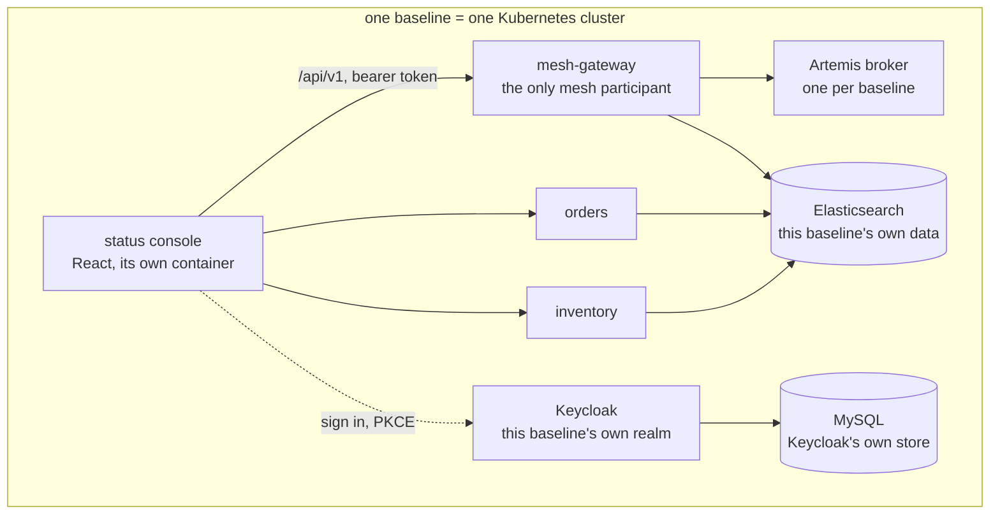
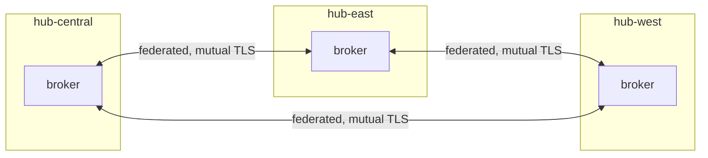
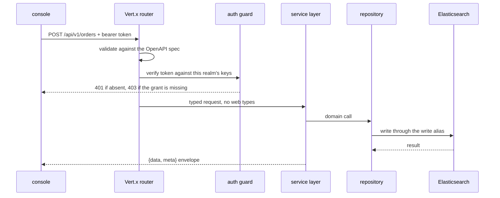
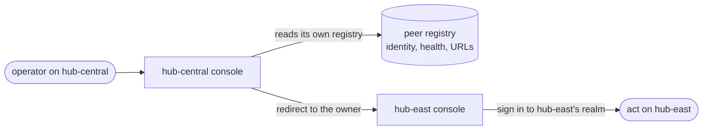

# A tour of Lattice

For an engineer who has not seen this before and wants to judge whether it holds up.

Lattice is a Java 21 / Vert.x 5 microservice platform where **a cluster is the unit of everything**. All the services in one Kubernetes cluster are a versioned **baseline**, separate baselines discover each other over an Apache Artemis mesh, and each keeps its own Elasticsearch data model - possibly divergent from its peers - while staying interoperable with them.

That last clause is the interesting one, and most of this tour is about what it costs.

**This page links rather than restates.** Every rule and decision is defined once in a leaf document; the tour is the path through them, plus the diagrams and the run-it-yourself steps that exist nowhere else. Where you see a locked decision number, that is the canonical record, and it will usually say more than the paragraph pointing at it - including what was rejected.

---

## 1. One baseline

A baseline is what a customer installs: one Helm release into one Kubernetes cluster.



Three things in that picture are deliberate and are where the design earns or loses its keep:

**Elasticsearch is the only datastore for Lattice's own data** (locked #7), and each baseline owns its model outright (locked #14). MySQL is there because Keycloak supports relational databases and nothing else - it is infrastructure that brought its own store, and no Lattice service ever connects to it (locked #72).

**The mesh-gateway is the sole mesh participant** (locked #42). If every service announced, they would all announce under the same cluster id and each hold a divergent registry.

**Keycloak is per baseline, including locally** (locked #48). A shared identity provider would make one baseline privileged over the others.

Detail: [services/_index.md](../design/services/_index.md) · [data_model.md](../design/architecture/data_model.md) · [per_baseline_identity.md](../design/features/per_baseline_identity.md)

---

## 2. The mesh

Three baselines, three Kubernetes clusters, three brokers. No central registry, no shared database, nothing either baseline has to be told about the other after the first connection.



**Federation rather than clustering** (locked #44). Clustering is built for one administrative domain running one version; federation is built for independent brokers that may differ - which is what baselines are. A joining baseline declares links to its peers, so **no existing baseline is edited, restarted or redeployed when a new one arrives**. Onboarding cost is linear and paid by the joiner.

**Brokers trust an authority, not each other** (locked #50, #58). Each carries an X.509 certificate signed by a shared authority, so the trust anchor names nobody and a new peer needs no edit anywhere. It also means revocation works without touching peers, and that two customers' meshes cannot federate by accident - their brokers trust different authorities, so the handshake simply fails.

**What travels the mesh is discovery, and only discovery** (locked #37). A `ClusterAnnouncement` carrying identity, health and two URLs. No work crosses it, no documents, no translation.

Detail: [mesh_broker_topology.md](../design/architecture/mesh_broker_topology.md) · [mesh_discovery.md](../design/architecture/mesh_discovery.md) · [mesh_envelopes.md](../design/architecture/mesh_envelopes.md)

---

## 3. How a request travels



The shape is the point: **routers are thin**, business logic never sees a `RoutingContext`, and every request and response body is defined once in `lattice-contract` - the module both the services and the console's generated client depend on, so the two cannot drift.

**Validation is the spec's job, not a handler's.** The same OpenAPI document drives router validation and generates the console's client.

Detail: [contract_protocol.md](../protocol/contract_protocol.md) · [api_structure.md](../design/architecture/api_structure.md) · [service_protocol.md](../protocol/service_protocol.md)

---

## 4. Interoperating without a shared schema

Two baselines both hold orders. Their Elasticsearch models may differ. How does an operator on one act on the other's data?

**They do not.** That is Shape A (locked #37):



An operator is **sent to the baseline that owns the data**, and authenticates there. Nothing is translated, because nothing crosses.

This is the decision most worth arguing with, so here is the honest version. The original design had a canonical envelope and per-cluster translation - genuine interop, at the cost of every baseline understanding every other baseline's model. Shape A trades that away. What it buys is that a baseline can change its model without coordinating with anyone, and the failure mode of a divergent model is "you have to click through", not "data is silently mistranslated".

It also has a consequence discovered later and recorded rather than hidden: the unified view **cannot** pull a peer's API from the browser (locked #61). Every `/api/v1` call is bearer-protected against the peer's own realm, membership is deliberately unsynchronised, and so a fan-out would return 401 from every peer. The view therefore renders each peer from the local registry - one data path instead of N+1, and no dependency on the operator holding credentials everywhere they can see.

Detail: [cluster_interop.md](../design/architecture/cluster_interop.md) · [interop_console.md](../design/features/interop_console.md)

---

## 5. Run it yourself

Three federating baselines on one machine, using the same Helm chart a customer receives. Prerequisites and versions: [DEVELOPMENT.md](../../DEVELOPMENT.md).

```bash
./deploy/certs/issue-certs.sh
./deploy/k8s/mesh-clusters.sh up
./deploy/k8s/mesh-clusters.sh images
./deploy/k8s/mesh-clusters.sh deploy
./deploy/k8s/mesh-clusters.sh seed
```

Consoles at `localhost:3000`, `:3001`, `:3002`, signing in as `operator` / `operator`. Expect a first run to take a while: three clusters are created, every image is built, and Keycloak migrates its schema before it will serve.

**Then break it on purpose.** The scenarios are the part worth your time, because each asserts a property rather than printing a log:

```bash
./deploy/k8s/mesh-clusters.sh scenario peer-lost
./deploy/k8s/mesh-clusters.sh scenario degraded
./deploy/k8s/mesh-clusters.sh scenario baseline-down
./deploy/k8s/mesh-clusters.sh scenario mesh-cut
./deploy/k8s/mesh-clusters.sh scenario loop-check
```

`baseline-down` asserts that **down is not the same as gone** - a baseline whose services have failed is still announcing, which is a different incident from one that has stopped talking. `mesh-cut` asserts that a broker outage leaves the gateway serving and its readiness `UP`, so an orchestrator does not remove the pod that is still answering. Certificate revocation and refusal of a foreign authority have their own scenarios.

**Watch the numbers while you break it.** Every service serves Prometheus metrics on its own management port, which is deliberately not published to the host, so a scrape is a port-forward away:

```bash
kubectl --context kind-hub-central port-forward svc/hub-central-lattice-mesh-gateway-metrics 9090:9090
curl -s localhost:9090/metrics | grep lattice_mesh
```

`lattice_mesh_announcements_received_total` is split by announcing cluster, so running `mesh-cut` shows the peers' counters stop advancing while `lattice_mesh_link_up` drops to 0 and `lattice_mesh_peer_expiries_total` climbs - the same incident the console narrates, in numbers. Nothing collects these yet; that is the open half of the observability work.

Full QA path: [qa_protocol.md](../protocol/qa_protocol.md)

---

## 6. Six decisions worth reading

Not the biggest ones - the ones where the reasoning is visible and something was given up.

| Decision | Why it is worth reading |
|---|---|
| [#44 federation, not clustering](../reference/locked_decisions.md) | Rejects the option that looks simpler, and names the property it is protecting: no existing baseline is edited when a new one joins. #47 then corrects its mechanism after the pinned Artemis version turned out not to support the attribute it specified - the guarantee survived, the mechanism did not. |
| [#59 polling, not streaming](../reference/locked_decisions.md) | A design session that measured instead of preferring, and inverted its own question: staleness is dominated by the peer time-to-live, not the poll, so a push transport would have won the smaller quarter of the budget. Neither transport can carry a bearer token either. |
| [#61 the unified view reads locally](../reference/locked_decisions.md) | A clause of an earlier decision corrected by the identity model that landed after it. The interesting part is that it is recorded as a correction rather than quietly rewritten. |
| [#67 fix the cause, not the reading](../reference/locked_decisions.md) | A single-node Elasticsearch is permanently yellow. Three options: relay the colour and train operators to ignore a warning, reinterpret yellow as ready, or fix the cause. Only one lies about nothing. |
| [#63 an accessibility regression, accepted and measured](../reference/locked_decisions.md) | The status-colour contrast bar drops to 3:1 because no colour in Material's orange ramp clears 4.5:1. It is written down as a regression with the measured ratios, not as an equivalent threshold. |
| [#71 fast-forward promotion](../reference/locked_decisions.md) | Written after a history reset caused by the decision it corrects. Squash carries content but not ancestry, so squashing a promotion left two branches that could never converge. |

The full register, append-only and never renumbered: [locked_decisions.md](../reference/locked_decisions.md).

---

## 7. What is not built, and what is not proven

The most useful section for judging a project, so it is not buried.

- **The mesh has crossed a cluster boundary, not a network one** (locked #56, amended by #75). Three kind clusters share one Docker bridge and reach each other by name. What is proven is that raw-TCP mutual TLS and the announce protocol survive a boundary between separate Kubernetes clusters. What is **not** proven is addressing and reachability: no network address translation, no firewall, no routable address, and the exposure is a NodePort rather than the TCP load balancer the delivery model calls for.
- **Hosting is deliberately not chosen.** Nothing yet needs to be reachable from outside a developer's machine, so picking a provider would be paying for a decision no work is waiting on.
- **Metrics exist; nothing collects them.** Every service registers a Prometheus registry and serves `/metrics` on its own management port, covering the Java Virtual Machine, the Hypertext Transfer Protocol surface, the mesh, and the Elasticsearch data layer (locked #78). What is **not** built is the collection stack: no scraper, no storage, no dashboards, and no alerting, because that needs somewhere to run and hosting is deferred. Tracing and log aggregation are deliberately excluded rather than pending.
- **There is no production environment.** The environment map has dev and prod columns; only local is real.
- **A container-image scan is not in CI.** Dependency and supply-chain scanning are; image scanning lands with the deploy pipeline.

---

## 8. How a change actually lands

Worth knowing before reading the commit history, because the history is shaped by it.

A ticket is picked from GitHub issues ranked by a priority label, claimed with an `in-progress` label so a concurrent agent can see who owns which files, and built **test-first** on a `lat-<issue>-<slug>` branch off `dev`. The local pre-push hook runs a scope-aware gate; CI runs the full reactor on every push. Then a founder builds and runs the branch on the three-baseline stack before any pull request exists - **no PR is opened before that**, not even a draft. `main` advances only by fast-forward.

The reason the commit messages are long is that this project treats **why** as the durable artifact: a diff shows what changed, and the reasoning is what stops the same question being re-litigated in three months.

Detail: [team_workflow.md](../protocol/team_workflow.md) · [core_protocol.md](../protocol/core_protocol.md) · [session_protocol.md](../protocol/session_protocol.md)

---

## Known gaps in this tour

Recorded here rather than left for you to notice.

- **No screenshots yet.** The console's cluster verdict, its infrastructure card, the unified mesh view and - most importantly - a degraded state should be shown, since a status console is judged on how it looks when something is wrong. They need a running stack and a signed-in session to capture, and they need refreshing whenever the console's visual direction changes.
- **The diagrams are Mermaid rather than drawn**, deliberately: they stay diffable and reviewable rather than becoming binary blobs nobody updates. The cost is that they are schematic.
- **No per-service walkthrough.** Orders and inventory are described in their own specs; this tour deliberately stops at the shape rather than repeating them.
