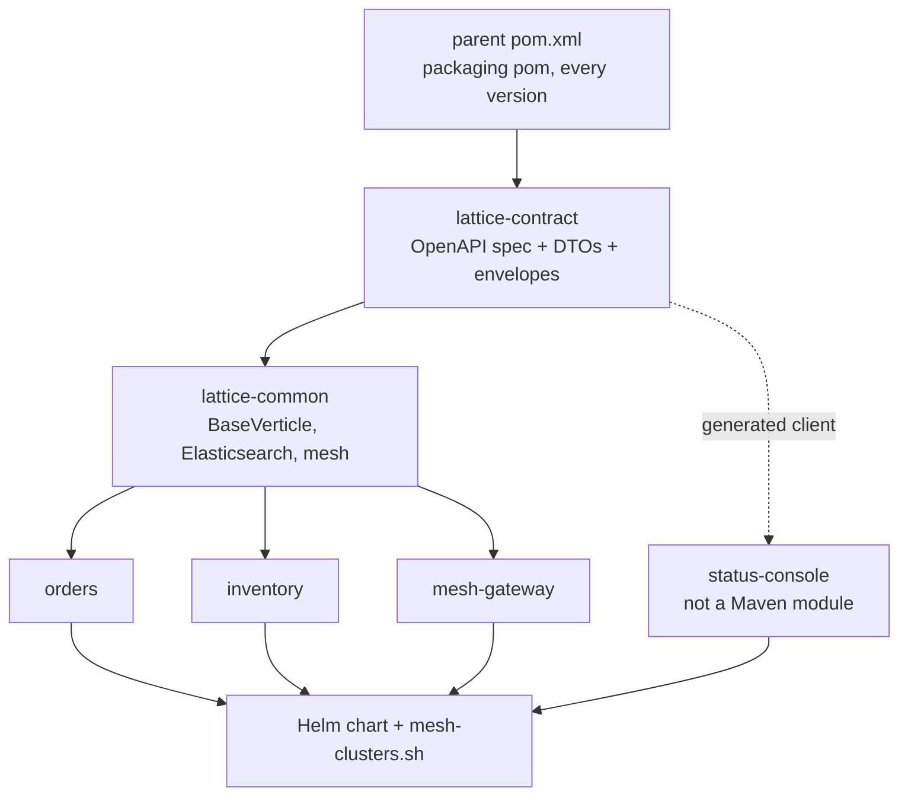
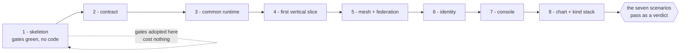

# Build it yourself

For an engineer who has read the [tour](_index.md), accepts the design, and now wants to reconstruct it.

`docs/` answers **why is it this way** completely. It answers **how do I build one from nothing** not at all, and that is a different question with a different shape: the reasoning is a web you can enter anywhere, and a build is an order you cannot. This page is that order.

**It is a sequencer, not a second copy.** Every rule, decision and interface is defined once in a leaf document and this page links to it. Three things have no home in any leaf document, and those are the only things it owns outright:

1. **The order** - what must exist before what, and the check that tells you a stage is finished.
2. **The stack manifest** - every pinned version and why it is pinned, recoverable today only by reading `pom.xml` and the console's lockfile.
3. **The registers** - the files that must be *reproduced* rather than derived from prose, and the code that was built without a design document.

**A warning about the last two, stated up front rather than discovered.** Reading `docs/` end to end will not let you regenerate this repository. The architecture and the reasoning are fully recoverable; the concrete interfaces are not. [`v1.yaml`](../../platform/lattice-contract/src/main/resources/openapi/v1.yaml) is 1,214 lines of source, not a derivative of any document, and the same is true of the gate rulesets, `broker.xml`, the realm file and the chart. The [artifact register](#the-artifact-register) is the honest list, with an acceptance check per entry so you can tell when your version is equivalent rather than merely similar.

---

## Domain neutrality

This repository models a regional fulfillment network: `orders`, `inventory`, and a `mesh-gateway`. **That is an illustration** ([example_domain.md](../reference/example_domain.md)), and only the gateway is structural. A real system built on this shape has a different domain and far more services.

So the stages below describe the **first vertical slice** generically, using `orders` as the worked example, and stop there. The second service and the fiftieth are the same repeatable path, and it is already scripted: [`/new-service`](../../.claude/skills/new-service/SKILL.md) for the module, [`/new-endpoint`](../../.claude/skills/new-endpoint/SKILL.md) for each operation on it. Nothing below scales by being read again.

---

## The order

Two constraints fix it. The **module graph** is a hard dependency order - a module cannot compile before what it imports. The **gate set** is a soft one, and it is the more important of the two: gates adopted on an empty reactor cost nothing, and gates adopted on a full one cost a sweep.

The dotted edge is the one worth pausing on: the console depends on the contract but is **not** a Maven module, so nothing in the build enforces that edge. It is held by a script (`pnpm generate:api`) that regenerates the console's types from the same `v1.yaml` the services validate against. The tree makes drift between two Java modules impossible and drift between Java and TypeScript merely detectable, which is why the console's own gate exists ([ui_protocol.md](../protocol/ui_protocol.md)).

---

## The stages

Eight stages. Each closes on an **acceptance check** you can run, because a stage that closes on judgement is a stage you will re-open.

The self-loop on stage 1 is the whole argument for the order. A gate adopted against an empty reactor is green by construction; the same gate adopted against a finished one is a sweep of every file it touches. This repository paid it both ways, and the [comment standard](../protocol/core_protocol.md#code-commenting-and-docstrings) is the worked example: arriving after the code, it cost 132 rewritten blocks across 62 files. Adopt the [gate set](#the-quality-gates) here.

### 1. The skeleton, and every gate green on nothing

The parent aggregator `pom.xml` (packaging `pom`), the Maven wrapper, the tracked pre-push hook, the continuous-integration workflow, and every quality gate in the [manifest](#the-quality-gates) - all of it before a single line of application code.

Two decisions land here and are cheap only here. The **em dash ban** is a build-failing Checkstyle rule, not a style preference. The **coverage floors** (line 90 percent, branch 80 percent) count integration coverage, which is what makes `jacoco-check` skip under `-DskipITs` and therefore what lets the pre-push hook run at all. Get that wrong and the hook can never pass, which is how this repository ran for a while: the reasoning is in [core_protocol.md](../protocol/core_protocol.md#ci-gates---all-blocking), the decision in [locked #74](../reference/locked_decisions.md).

> **Acceptance:** `./mvnw verify` passes on a reactor with no modules, and `git config core.hooksPath .githooks` makes a push run it.

### 2. `lattice-contract`

The versioned seam, and single-writer by rule ([contract_protocol.md](../protocol/contract_protocol.md)). It is first because both sides of every later wire depend on it: the OpenAPI 3.1 document drives Vert.x router validation *and* generates the console's TypeScript client, so it cannot follow either.

What lives here: the OpenAPI specification under `src/main/resources/openapi/`, the request and response records, and the Artemis mesh envelopes. What does **not**: any business logic, and any shape inlined in a service.

Read [api_structure.md](../design/architecture/api_structure.md) for the `{data|error, meta}` envelope and its error-code taxonomy, and [mesh_envelopes.md](../design/architecture/mesh_envelopes.md) for the header every mesh message carries. `v1.yaml` itself is an [artifact](#the-artifact-register), not a derivative of either.

> **Acceptance:** the module builds and its unit tests pin every operation shape and envelope record; `openapi-typescript` generates from the specification without error.

### 3. `lattice-common`

The shared runtime, and the stage that decides whether "reuse over rebuild" is structural or aspirational. Every service extends `BaseVerticle` for configuration, health, readiness, the `/api/v1` guard and the management port; every service reads Elasticsearch through `EsRepository`. A service that wanted its own health endpoint has to go out of its way, which is the point.

Elasticsearch mapping work is the **one documented exception** to test-first: a mapping cannot be queried until the index exists, so the specification-driven integration tests are written in the same change ([core_protocol.md](../protocol/core_protocol.md#documented-exception)). Say so explicitly when you use it.

Read [data_model.md](../design/architecture/data_model.md) for index-per-entity, the read and write aliases, and the reindex-behind-alias procedure. The mesh client and peer registry land here too, but nothing calls them until stage 5.

> **Acceptance:** a Testcontainers-backed integration suite bootstraps every index from its committed mapping and reads a document back through the alias.

### 4. The first vertical slice

One service, end to end: a `BaseVerticle` subclass, a thin router mounting operations claimed from the contract, a service layer that never sees a `RoutingContext`, a repository over `EsRepository`, a Dockerfile, and both test layers. `orders` is the worked example; the shape is what generalises.

This is the first stage where the **route is thin** rule is testable rather than agreed. It is also where you find out whether stage 2's specification was actually complete, because router validation is the specification's job and a gap shows up as a request that should have been rejected and was not.

> **Acceptance:** `./mvnw verify` green with a route contract test (a `WebClient` against the deployed verticle, asserting both the success and the error envelope) and a Testcontainers integration test against real Elasticsearch.

### 5. The mesh, and federation across brokers

The `mesh-gateway`, one Artemis broker per baseline, and broker federation between them. This is the largest single step in the build and the one with the most non-obvious mechanism, so read before you write:

- [mesh_discovery.md](../design/architecture/mesh_discovery.md) - the announce protocol, the 10-second heartbeat, the 30-second peer time-to-live.
- [mesh_broker_topology.md](../design/architecture/mesh_broker_topology.md) - federation rather than clustering, `max-hops="1"`, and why a joining baseline configures both directions so no existing broker is ever edited.
- [federation_link_visibility.md](../design/features/federation_link_visibility.md) - the two links, and why reporting only one made a healthy reading read as a healthy mesh.

Three things here are measured facts about Artemis rather than design choices, and each cost a detour to find. The announce address must be addressed as a **topic**: treated as a queue the broker load-balances announcements and each peer sees a fraction of the mesh ([locked #41](../reference/locked_decisions.md)). There is **no `downstream-authorization` attribute** in the pinned Artemis schema, so a broker configured from the superseded description fails validation and does not start ([locked #47](../reference/locked_decisions.md)). And Artemis management exposes **nothing** about the broker's own certificate, which is what forces the TLS handshake read in `BrokerCertificate` ([locked #80](../reference/locked_decisions.md)).

> **Acceptance:** two baselines discover each other from a cold start, and `loop-check` measures `max-hops=1` at the broker.

### 6. Identity

Keycloak per baseline, its realm imported from a committed file, and `ApiSecurity` in `BaseVerticle` gating all of `/api/v1` while leaving `/health` and `/readiness` open. Bearer-only validation against the realm's key set, so a Keycloak outage does not invalidate tokens already issued.

Read [per_baseline_identity.md](../design/features/per_baseline_identity.md) for the two roles, the public client using Proof Key for Code Exchange, and the deliberately unsynchronized membership. The realm file is an [artifact](#the-artifact-register): its redirect addresses are derived from the console address and the service ports, and a console served anywhere else is refused with `Invalid parameter: redirect_uri`.

Gating in `BaseVerticle` rather than per service is the same reasoning as one certificate authority per environment - it converts a rule you must remember into one you cannot break.

> **Acceptance:** an unauthenticated `/api/v1` call returns 401, a token missing the grant returns 403, and both probes still answer without one.

### 7. The status console

React with Vite and TypeScript, its own container, its own gate set. It is not a Maven module, so `./mvnw verify` does not cover it and the pre-push hook runs a second command.

Read [ui_protocol.md](../protocol/ui_protocol.md) for the framework rules and [design/ui/](../design/ui/_index.md) for the visual direction: the cluster verdict first, colour never the sole indicator, and every size from Material UI's 8-pixel grid. The client is **generated** from `v1.yaml`, never hand-declared.

One rule here is easy to get backwards and is load-bearing: **the console renders verdicts, it does not compute them**. The gateway rolls its services' readiness into one label and the console displays that value. Recomputing it in the browser forks the definition of "degraded" across two languages and lets the console disagree with what the baseline announces to its peers. The single documented exception is the mesh rollup, which is arithmetic over a field the registry already sets.

> **Acceptance:** the console's own `verify` script passes (Biome, types, the comment and token checks, knip, Vitest with coverage), and the generated client compiles against the current specification.

### 8. The chart, the local stack, and the scenarios

The Helm umbrella chart with a subchart per component over a mandatory library chart, and `mesh-clusters.sh` creating three kind clusters, one baseline each.

Read [baseline_configuration.md](../design/architecture/baseline_configuration.md) for why configuration has exactly **one authored source**, and note the principle underneath it, which generalises past Helm: every clean fix in that work replaced a second **declaration** with a **derivation**. The version is declared once and the image tag derives from it; the redirect addresses derive from the console address; the infrastructure card derives from the federation states rather than probing separately.

The build is finished when the seven failure scenarios pass. They are the acceptance check for the whole thing, not a demonstration, because each opens with a **control** asserting the healthy pre-state and turns a failed assertion into the exit status.

> **Acceptance:** `./deploy/k8s/mesh-clusters.sh check` renders every baseline and passes its own self-test, then all seven scenarios pass. The narrated order, with expected recovery times, is the [demo runbook](demo_runbook.md).

---

## The stack manifest

Every pinned version, and why it is pinned. Recoverable today only by reading [`pom.xml`](../../pom.xml) and [`ui/status-console/package.json`](../../ui/status-console/package.json).

### The Java reactor

| Component            | Version | Why this pin                                                                                                                                                       |
|----------------------|---------|--------------------------------------------------------------------------------------------------------------------------------------------------------------------|
| Java                 | 21      | One long-term-support runtime; the enforcer fails outside `[21,22)` ([locked #1](../reference/locked_decisions.md))                                                |
| Maven                | 3.9.16  | Pinned per checkout by the committed wrapper, so no system Maven is required                                                                                       |
| Vert.x               | 5.1.5   | Imported as `vertx-dependencies`, which manages every `io.vertx` artifact together ([locked #2](../reference/locked_decisions.md))                                 |
| JUnit                | 5.14.0  | Imported as `junit-bom`                                                                                                                                            |
| Testcontainers       | 2.0.5   | Imported as `testcontainers-bom`; must pin the same Elasticsearch tag the deploy manifests use                                                                     |
| Elasticsearch client | 8.19.19 | One property drives the client dependency, the Testcontainers image and the deploy image ([locked #34](../reference/locked_decisions.md))                          |
| Jackson              | 2.21.5  | Pinned to the version Vert.x manages, so the Elasticsearch client's Jackson converges instead of forking a second copy                                             |
| SLF4J                | 2.0.17  | Pinned to what `logback-classic` pulls, so the explicit declaration and the transitive one converge                                                                |
| Logback              | 1.5.34  | The one binding; Vert.x's own logging is routed through the same pipeline ([locked #39](../reference/locked_decisions.md))                                         |
| OpenTelemetry        | 1.62.0  | Imported as a bill of materials to lift the whole family **above** the advisory-carrying version the Elasticsearch client drags in                                 |
| Micrometer registry  | 1.16.6  | Must track the `micrometer-core` Vert.x resolves; the registry is the one metrics artifact that bill of materials does not manage, so it is the one that can drift |
| Swagger UI assets    | 5.25.3  | Bundled rather than fetched, so the documentation page works air-gapped ([locked #55](../reference/locked_decisions.md))                                           |

Four entries in that table exist for the same reason: `dependencyConvergence` is on, so a transitive version fork fails the build rather than resolving quietly to whichever copy wins. The Apache HttpComponents, `commons-codec` and `jakarta.json` pins in the parent are the same mechanism and align versions rather than adding engines.

### The quality gates

| Gate                            | Version                                       | Runs                                                                                                |
|---------------------------------|-----------------------------------------------|-----------------------------------------------------------------------------------------------------|
| Spotless + Palantir Java Format | 3.8.0 / 2.96.0                                | `verify`; `spotless:apply` fixes drift                                                              |
| Checkstyle                      | plugin 3.6.0, engine 13.8.0                   | `verify`; carries the em dash ban and Javadoc rules, no formatting rules                            |
| JaCoCo                          | 0.8.15                                        | `verify`; line 90 percent, branch 80 percent, skipped under `-DskipITs`                             |
| maven-enforcer                  | 3.6.3                                         | `verify`; Java 21, convergence, no duplicate declarations                                           |
| SpotBugs + FindSecBugs          | plugin 4.10.3.0, engine 4.10.3, plugin 1.14.0 | `verify`; main **and** test sources                                                                 |
| PMD                             | plugin 3.28.0, engine 7.26.0                  | `verify`; exactly two rules, main and test sources ([locked #60](../reference/locked_decisions.md)) |
| CycloneDX                       | 2.9.2                                         | `verify`; emits the bill of materials the supply-chain scan reads                                   |
| OSV-Scanner                     | v2.3.8                                        | Continuous integration only, a pinned binary, not a Maven plugin                                    |

Two of these are counter-intuitive and are decisions rather than defaults. **PMD is a second static-analysis engine alongside SpotBugs**, which the one-engine rule would normally forbid: they are blind in opposite directions, because `javac` inlines a compile-time constant so no bytecode tool can tell an unused constant from a used one. **The supply-chain scan reads the generated bill of materials rather than the POM files**, because a scanner resolving remotely cannot see this reactor's own unpublished modules and drops the entire graph while reporting zero vulnerabilities.

### The console

| Component          | Version        | Why this pin                                                                                    |
|--------------------|----------------|-------------------------------------------------------------------------------------------------|
| Node.js            | 24             | In `.nvmrc` rather than a POM; the console is deliberately outside Maven                        |
| pnpm               | 11.5.1         | Declared as `packageManager` so the version travels with the repository                         |
| React              | 19.2.8         | With `react-dom` at the same version                                                            |
| Material UI        | 9.2.0          | With `@mui/icons-material` at the same version ([locked #62](../reference/locked_decisions.md)) |
| Emotion            | 11.14          | The only styling engine; inline style props are removed, not merely discouraged                 |
| TanStack Query     | 5.101.4        | The data layer; unit tests mock at this seam rather than at the network                         |
| keycloak-js        | 26.2.4         | The public client using Proof Key for Code Exchange                                             |
| react-router       | 8.3.0          | Navigation between the status, operational and metrics views                                    |
| Vite / Vitest      | 8.1.5 / 4.1.10 | Build and test                                                                                  |
| TypeScript         | 5.9.3          | `tsc --noEmit` is a gate in its own right                                                       |
| Biome              | 2.5.5          | Lint and format in one tool, mirroring Spotless plus Checkstyle on the Java side                |
| knip               | 6.29.0         | Dead-code gate                                                                                  |
| openapi-typescript | 7.13.0         | Generates the client from `v1.yaml`                                                             |

### The runtime images

| Image                                           | Tag                         | Notes                                                                                                         |
|-------------------------------------------------|-----------------------------|---------------------------------------------------------------------------------------------------------------|
| `eclipse-temurin`                               | `21-jre`                    | The shared base for all three service images; declares a numeric user, which `runAsNonRoot` needs             |
| `node` / `nginx`                                | `24-alpine` / `1.29-alpine` | The console's build and runtime stages                                                                        |
| `apache/activemq-artemis`                       | `2.44.0-alpine`             | The schema that has no `downstream-authorization` attribute                                                   |
| `docker.elastic.co/elasticsearch/elasticsearch` | `8.19.19`                   | Same property as the client version                                                                           |
| `quay.io/keycloak/keycloak`                     | `26.4.2`                    | Dev mode locally, `start` against MySQL when persisted                                                        |
| `mysql`                                         | `8.4`                       | Keycloak's own store; no Lattice service ever connects to it ([locked #72](../reference/locked_decisions.md)) |

---

## The artifact register

**These files are sources, not derivatives.** No document generates them, and reading every document will not reproduce them. Each row carries an acceptance check that tells a rebuilder when their version is equivalent rather than merely similar.

| Artifact                                                                                                                             | What it is                                                                                                                                | Acceptance check                                                                                                                                             |
|--------------------------------------------------------------------------------------------------------------------------------------|-------------------------------------------------------------------------------------------------------------------------------------------|--------------------------------------------------------------------------------------------------------------------------------------------------------------|
| [`platform/lattice-contract/src/main/resources/openapi/v1.yaml`](../../platform/lattice-contract/src/main/resources/openapi/v1.yaml) | 1,214 lines. Every operation, schema, and error shape, driving both router validation and the generated client                            | Every service's router mounts its claimed operations with no unmatched-operation warning; `pnpm generate:api` produces a client the console compiles against |
| [`config/checkstyle/checkstyle.xml`](../../config/checkstyle/checkstyle.xml)                                                         | The style gate, including the em dash ban as a build-failing regular expression                                                           | A file containing one em dash fails `./mvnw verify`                                                                                                          |
| [`config/pmd/pmd-ruleset.xml`](../../config/pmd/pmd-ruleset.xml)                                                                     | Exactly two rules, and the reasoning for keeping it at two                                                                                | An unused `private static final` constant fails the build; nothing else new does                                                                             |
| [`config/spotbugs/spotbugs-exclude.xml`](../../config/spotbugs/spotbugs-exclude.xml)                                                 | Three documented exclusions, each with a stated removal condition, two of them scoped to integration tests by class name                  | The reactor is green, and the same finding in shipped code is **not** masked                                                                                 |
| [`.semgrep/lattice-rules.yml`](../../.semgrep/lattice-rules.yml)                                                                     | The committed rules alongside the registry packs                                                                                          | The Semgrep job passes on a clean tree and flags a planted violation                                                                                         |
| [`ui/status-console/biome.jsonc`](../../ui/status-console/biome.jsonc) · [`knip.jsonc`](../../ui/status-console/knip.jsonc)          | The console's lint, format and dead-code configuration                                                                                    | `pnpm verify` passes; an unreferenced export fails knip                                                                                                      |
| [`ui/status-console/scripts/`](../../ui/status-console/scripts/)                                                                     | Three hand-written gates: comment length, TSDoc presence, and colour literals                                                             | `check:tokens` fails on a colour literal outside the theme file, including inside an `sx` prop                                                               |
| [`deploy/k8s/chart/charts/artemis/files/artemis/broker.xml`](../../deploy/k8s/chart/charts/artemis/files/artemis/broker.xml)         | The broker configuration: the federation element, the multicast announce address, `max-hops="1"`, the acceptors                           | Two brokers federate; `loop-check` measures one hop                                                                                                          |
| [`deploy/k8s/chart/charts/keycloak/files/lattice-realm.json`](../../deploy/k8s/chart/charts/keycloak/files/lattice-realm.json)       | The realm: two roles, matching groups, the public client, and redirect addresses templated from the console address                       | A console at the chart's address signs in; one at any other address is refused with `Invalid parameter: redirect_uri`                                        |
| [`deploy/k8s/chart/`](../../deploy/k8s/chart/)                                                                                       | The umbrella plus nine charts under `charts/`, one of them the mandatory library chart every other uses                                   | `mesh-clusters.sh check` renders every baseline, passes its own self-test, and flags no duplicate environment key or missing security context                |
| [`deploy/k8s/chart-lint.awk`](../../deploy/k8s/chart-lint.awk)                                                                       | The render assertions, plus the fixtures under `testdata/` that test the lint itself                                                      | The lint flags every planted fixture; a lint that stopped matching fails loudly rather than passing everything                                               |
| [`deploy/k8s/mesh-clusters.sh`](../../deploy/k8s/mesh-clusters.sh)                                                                   | 1,101 lines. The whole local stack: cluster creation with pinned host ports, image build, deploy, seed, redeploy, and the seven scenarios | `up`, `images`, `deploy`, `seed` produce three federating baselines; all seven scenarios pass                                                                |
| [`deploy/certs/issue-certs.sh`](../../deploy/certs/issue-certs.sh)                                                                   | The certificate authority and per-baseline broker certificates. **The tool a customer runs**, not local-only scaffolding                  | Three baselines federate over mutual TLS; `revoked-east` and `foreign-authority` are both refused                                                            |
| [`.githooks/pre-push`](../../.githooks/pre-push)                                                                                     | The scope-aware local gate: the reactor for Java, the console's verify for console code, nothing for docs                                 | A Java change runs the reactor; a documentation-only push runs nothing                                                                                       |
| [`.github/workflows/ci.yml`](../../.github/workflows/ci.yml)                                                                         | Seven jobs, triggered on `push` only, to `dev` and `lat-*`                                                                                | A red run blocks the merge on both merge points                                                                                                              |

Two entries deserve their generalisation stated. `chart-lint.awk` **tests itself against committed fixtures before it tests anything real**, because a lint that silently stopped matching would pass everything forever and read as health. The same shape appears in the federation scenarios, which exist because the federation reading depends on Artemis queue naming and a rename would make that signal fail *to healthy*. When a check can fail in the direction of good news, something has to check the check.

---

## The built-but-undesigned register

**Code with no design document.** Not a defect list and not a backlog: each of these was built inside a ticket whose subject was something else, and the reasoning went into the class documentation rather than into `docs/design/`. A rebuilder reading only `docs/` will not know these exist.

The register is honest about where the reasoning actually lives, because in every case it does exist and is unusually complete - it is in the source.

| Code                                                                                                                                                    | What it does                                                                                                                                                  | Where the reasoning is                                                                                                                                          |
|---------------------------------------------------------------------------------------------------------------------------------------------------------|---------------------------------------------------------------------------------------------------------------------------------------------------------------|-----------------------------------------------------------------------------------------------------------------------------------------------------------------|
| `DataJob`, `DataJobs`, `DataJobRunner`, `DataJobGuard`                                                                                                  | The data-maintenance jobs a baseline runs against its own Elasticsearch, run from the already-built service image by overriding the container command         | Class documentation. The reindex *procedure* is in [data_model.md](../design/architecture/data_model.md); the job harness and its guard are not in any document |
| `DevDataset`                                                                                                                                            | The seed data, deliberately different per baseline so the divergent-model claim is demonstrated rather than asserted                                          | Class documentation                                                                                                                                             |
| `OwnedOperations`                                                                                                                                       | Narrows the shared contract to the operations one service actually serves, so no unmounted operation exists and the documentation page stops advertising 404s | Class documentation                                                                                                                                             |
| `BrokerCertificate`                                                                                                                                     | Reads the broker's own certificate by completing a TLS handshake against it                                                                                   | Class documentation; the *decision* to read it this way is [locked #80](../reference/locked_decisions.md)                                                       |
| `RetryingGate`, `LatticeBootstrap`                                                                                                                      | The startup retry, and the shared `Vertx` construction that metrics require before `BaseVerticle` can reach it                                                | Class documentation; the constraint that forced the bootstrap helper is in [observability.md](../design/architecture/observability.md)                          |
| `ArrivalCard`, `ConnectionLost`, `ListPanel`, `PanelHeader`, `PanelHelp`, `PanelRollup`, `ViewerNotice`, `BarSegment`, `ConsoleScreen`, `LoadingScreen` | The console's shared layout and state vocabulary, beneath the components [design/ui/](../design/ui/_index.md) does name                                       | Component TSDoc only                                                                                                                                            |
| `ThemeMenu`, `useThemeChoice`                                                                                                                           | Light, dark and system theme selection                                                                                                                        | Nothing. [material_ui.md](../design/ui/material_ui.md) settles the palette in both modes but never specifies who chooses the mode                               |
| `motion.ts`, `useJustChanged`                                                                                                                           | The console's motion durations and its just-changed highlight                                                                                                 | Nothing. [ui_protocol.md](../protocol/ui_protocol.md) requires motion durations to be tokens and does not say what they are                                     |

The last two rows are the ones to look at hardest if you are reconstructing. Everything above them was designed somewhere, even if that somewhere is a Javadoc block. A theme chooser and a motion system are **product surface** that no document settles at all, and a rebuilder will either reinvent them or not notice they are missing.

---

## Does this hold at N services?

Both of these are sized for three services today, which is small enough that neither has been stressed. Recorded here rather than left for you to hit.

**The console's per-service breakdown.** The cluster verdict is a rollup and does not change with service count; the detail strip beneath it renders one row per service. That is already flagged as `Density at scale` in [design/ui/](../design/ui/_index.md#open), and the answer is known - the virtualized list the protocol already calls for, with the verdict block untouched. It is a screen problem, not a protocol one.

**The heartbeat, and what is actually O(N) in it.** The announcement itself is **not** the thing that grows, and this is worth being precise about because the intuitive answer is wrong. `ClusterAnnouncement` is a fixed six-field record carrying one rolled-up `health` string; the per-service breakdown and the infrastructure array are served on `getBaseline` and never announced ([locked #43](../reference/locked_decisions.md), [locked #66](../reference/locked_decisions.md)). So the wire is O(1) in service count **by design**, and that design is the reason it holds.

What is O(N) is the **poll behind it**: the gateway probes every service named in `CLUSTER_SERVICES` in one parallel fan-out per cycle, at a 10-second default heartbeat. The umbrella chart authors that list and deliberately leaves the gateway out of it, since its own readiness cannot fail, so today's three-service baseline polls two of them - 12 readiness probes a minute. At fifty services it is 294, all from one pod, on a fixed interval that does not adapt. Nothing has measured where that stops being free: the probe is a plain readiness call and the fan-out is already parallel, so the ceiling is likely a connection-pool question rather than a design one, but it is unmeasured and should be treated as such.

The second-order effect is the sharper one: the announced verdict is a rollup of that poll, so a slow probe at large N delays the verdict every peer reads. The mesh's staleness budget is dominated by the 30-second peer time-to-live today ([locked #59](../reference/locked_decisions.md) measured this), and a poll that stopped completing inside a heartbeat would move that budget without anything reporting that it had.

---

## Cross-references

- [The tour](_index.md) - what the system is and why, which this page assumes you have read.
- [The demo runbook](demo_runbook.md) - the narrated order through the seven scenarios, which stage 8 closes on.
- [DEVELOPMENT.md](../../DEVELOPMENT.md) - the machine setup and verified tool versions.
- [core_protocol.md](../protocol/core_protocol.md) - the test-first loop, the branching model, and the gate set.
- [locked_decisions.md](../reference/locked_decisions.md) - the append-only registry every stage above points into.
