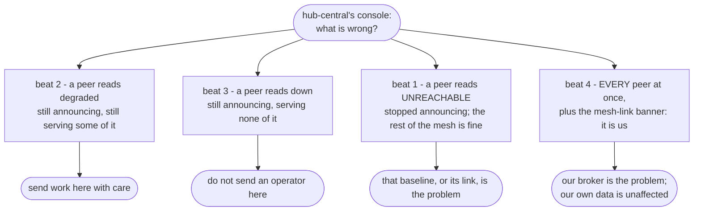

# Demonstrating Lattice - a runbook

A path through the failure scenarios, in an order that builds an argument rather than listing
features. It assumes a **warm stack** and is written to be followed start to finish without
improvising: every beat carries the command, where to look, what the audience should notice, and
how long the recovery takes so a pause does not read as a hang.

The narrative background is the [tour](_index.md). This page is the live counterpart to its
section 5: the tour says what Lattice is, this says what to do with your hands.

**The argument, in one line.** A distributed system is easy to demonstrate while it works. What
is worth watching is whether it can tell its own failures apart - a peer that is broken from a
peer that is gone, and both from being cut off yourself.

---

## Before the audience arrives

The scenarios need a stack that is already up, already seeded, and already federating. Bringing
one up from nothing in front of people is half an hour of watching images build.

### Cold bring-up (do this well ahead)

```bash
./deploy/certs/issue-certs.sh          # once per machine; nothing federates without it
./mvnw install                         # build every module
./deploy/k8s/mesh-clusters.sh images   # build and side-load the service + per-baseline consoles
./deploy/k8s/mesh-clusters.sh up       # create the three kind clusters
./deploy/k8s/mesh-clusters.sh deploy   # one Helm release per baseline
./deploy/k8s/mesh-clusters.sh seed     # otherwise Orders and Inventory open empty
```

Budget roughly **ten minutes per baseline** for a cold `up`, before image builds, and allow for
Keycloak migrating its schema on first start. The per-step costs are the redeploy table in
[core_protocol.md](../protocol/core_protocol.md#redeploy-granularity---reach-for-the-smallest-one-that-works);
the practical reading of it is that only `deploy` is cheap, and a host-port change forces a full
recreate whatever else you do.

`up` is idempotent, so a stack from yesterday needs only `deploy` (seconds) and possibly `seed`.

### What "warm" means

All four of these, or the first scenario's control will fail and the demonstration opens on a
failure that is not the one you meant:

1. **Three clusters running and reachable on the shared bridge** - `mesh-clusters.sh status`.
2. **Every pod ready** in all three - `mesh-clusters.sh pods`. Nothing pending, nothing in a
   crash loop.
3. **All three consoles signed in**, in three browser tabs: `localhost:3000` (hub-central),
   `:3001` (hub-east), `:3002` (hub-west), as `operator` / `operator`. Sign in before you start;
   a login screen mid-demonstration costs a minute and reads as a fault.
4. **Seeded**, so Orders and Inventory have something in them.

### Pre-flight, five minutes before

```bash
./deploy/k8s/mesh-clusters.sh status   # each node resolves and reaches the other two
./deploy/k8s/mesh-clusters.sh pods     # all three baselines at once
```

On hub-central's console, confirm the **Discovered Mesh** panel lists hub-east and hub-west, both
`REACHABLE`. If either is not, nothing below will demonstrate anything - wait out a time-to-live
(30 seconds) and look again before touching anything.

### The two numbers everything below depends on

| Setting | Value | Why it shows up in every beat |
|---|---|---|
| Announce cadence | 10 seconds | how often a baseline says it is alive |
| Peer time-to-live | 30 seconds | how long silence takes to become `UNREACHABLE` |
| Console poll | 10 seconds | the screen is never more than one poll behind the answer |

A peer therefore takes **up to about 40 seconds** to flip after it goes quiet - the time-to-live
plus a poll. That is the number to say out loud before the first wait, so the wait reads as the
design rather than as a hang.

---

## The running order

Seven scenarios, ordered so each one is the setup for the next. The pairing that carries the
whole argument is beats 1 and 3: **`peer-lost` is what "gone" looks like, and `baseline-down`
only means something once the audience has seen it.**

| # | Scenario | The point it makes | Roughly |
|---|---|---|---|
| 0 | (none - the healthy picture) | what "working" looks like, so a change is visible | 2 min |
| 1 | `peer-lost` | this is **gone**: aged out, marked `UNREACHABLE`, and still listed | 4-5 min |
| 2 | `degraded` | partial: still serving, not whole - and the verdict travels to the peer | 5-7 min |
| 3 | `baseline-down` | **down is not gone**: it cannot serve and is still being heard | 6-9 min |
| 4 | `mesh-cut` | it is **us**, not them: every peer ages out at once and we keep serving | 6-9 min |
| 5 | `loop-check` | loop prevention, measured at the broker rather than asserted | 5-6 min |
| 6 | `revoked-east` | revocation with **no edit** to the revoked baseline | 3-5 min |
| 7 | `foreign-authority` | the truststore is the gate, not the certificate's contents | 2-3 min |

Beats 1 through 4 are one argument in four parts, and it is worth having the shape of it in mind
before you start. Each beat breaks something different, and the console has to reach a different
conclusion from each:



Four different faults, four different responses. A system that collapsed any two of these into
one reading would send somebody to the wrong place, and beat 4 is the one most systems get wrong -
being cut off looks exactly like everyone else dying, unless something says otherwise.

The whole run is roughly **35 to 45 minutes**. For a shorter slot, beats 0 through 4 are the
coherent half and take about 25 minutes; beats 6 and 7 are the natural stopping point after them
if the audience cares about trust rather than about failure modes.

The certificate scenarios stay last, and that is sequencing rather than taste: they rewrite
broker TLS material and roll brokers, so a beat that goes wrong there leaves the mesh needing its
re-issue step. Everything else has already been shown by then. `scenario all` runs them last for
the same reason.

**Run each one in its own terminal invocation, not `scenario all`.** `all` is the verdict; these
are the narration.

---

## Beat 0 - the healthy picture

No command. Two minutes on hub-central's console, naming the four panels, so every later change
lands somewhere the audience has already looked.

- **Baseline** - this baseline's own verdict and the per-service breakdown behind it. Note that
  the breakdown is served here and never announced: a peer learns one word, not a service list.
- **Infrastructure** - Elasticsearch, Artemis and Keycloak, each in its own system's vocabulary.
  It is deliberately not part of the announced verdict.
- **Discovered Mesh** - hub-east and hub-west, with health, reachability and an age.
- **Activity** - the transitions, not the states. This is the panel that will narrate everything
  below, so point at it now while it is quiet.

Then open **Metrics** and leave it a minute so the cards have a second reading. A card with one
reading says it is waiting rather than printing a rate it cannot know. **Announces** should sit
at a positive per-minute figure and **Peers reachable** at `2 / 2`.

Say what the audience is about to be shown: three independent baselines, no shared database, no
central registry, and nothing either baseline was told about the other after the first
connection.

---

## Beat 1 - a peer goes quiet

```bash
./deploy/k8s/mesh-clusters.sh scenario peer-lost
```

**What it does.** Scales hub-east's gateway to zero. The gateway is the sole mesh participant, so
hub-east stops announcing while the rest of hub-east keeps running.

**Where to look.** hub-central's console: the **Discovered Mesh** panel, and the **Activity**
panel beside it.

**What to notice.**

- Nothing happens for up to 40 seconds. That is the time-to-live doing its job, and it is worth
  saying so before the silence rather than during it.
- hub-east then flips to `UNREACHABLE` **and stays on the panel**, holding its last-known region,
  baseline version and health. It does not vanish. A row that disappears answers "what happened
  to hub-east" with nothing at all.
- hub-central's own verdict does not move. A lost peer is not a local outage.

**Recovery.** The scenario restores the gateway and waits for `REACHABLE` again, budgeted at 180
seconds; in practice it is usually well inside a minute once the pod is ready.

**Asserted vs displayed.** The flip to `UNREACHABLE`, the row still being there to read it from,
and hub-central's own verdict staying `ready` are all **asserted** - the scenario fails if any of
them does not hold. The *contents* of the retained row are **displayed only**, which is why this
beat wants a screen and not just a terminal.

---

## Beat 2 - one service in a baseline is down

```bash
./deploy/k8s/mesh-clusters.sh scenario degraded
```

**What it does.** Stops orders on hub-east - one service of the rollup, and not its gateway, so
hub-east keeps announcing throughout.

**Where to look.** Two consoles this time. hub-east's **Baseline** panel, then hub-central's
**Discovered Mesh** row for hub-east.

**What to notice.**

- hub-east computes `degraded` for itself, and its own breakdown names *which* service is missing.
- hub-central's row for hub-east also reads `degraded` - and that is a second fact, not a repeat
  of the first. The first proves the rollup is computed; the second proves it crossed the mesh.
- hub-central still sees only the word. It never learns which service failed, because the
  breakdown deliberately does not ride the announcement.

That last point is the one worth pausing on: a peer deciding whether to send an operator here
needs "still serving, but not whole" to read differently from "cannot serve", and needs nothing
more than that.

**Recovery.** Orders is restored; hub-east returns to `ready` (budgeted 240 seconds) and
hub-central's view follows (120 seconds).

**Asserted vs displayed.** Both verdicts, on both sides, are **asserted**. Which service is named
in the breakdown is **displayed only**.

---

## Beat 3 - every service in a baseline is down

```bash
./deploy/k8s/mesh-clusters.sh scenario baseline-down
```

**What it does.** Stops orders *and* inventory on hub-east - everything the rollup covers. The
gateway stays up.

**Where to look.** hub-central's **Discovered Mesh** row for hub-east, with beat 1 still fresh.

**What to notice.**

- hub-east's verdict goes to `down`. It cannot serve anything.
- hub-central still shows it **`REACHABLE`**. This is the beat the running order exists for: in
  beat 1 the same panel said `UNREACHABLE`, and the audience has just seen what that looks like.
  A baseline that cannot serve and a baseline nobody can hear are different incidents with
  different responses, and the panel distinguishes them.

If you only make one point from the whole run, make it here.

**Recovery.** Both services are restored and hub-east returns to `ready`, budgeted at 300
seconds. This is the longest wait in the run - two services starting, each bootstrapping its
Elasticsearch indices - so say so before it starts.

**Asserted vs displayed.** The `down` verdict and the peer staying `REACHABLE` are both
**asserted**.

---

## Beat 4 - a baseline loses its own broker

```bash
./deploy/k8s/mesh-clusters.sh scenario mesh-cut
```

**What it does.** Stops **hub-central's own** broker - the machine whose console you have been
watching. Every baseline runs its own broker, so this cuts hub-central off the mesh and leaves
hub-east's and hub-west's brokers untouched.

**Where to look.** hub-central's console, the **Discovered Mesh** panel. Then hub-east's console
for the contrast.

**What to notice.**

- The panel gains a **"Mesh link down · snapshot"** banner and pins the clock time the snapshot
  was taken. Then, over the next time-to-live, *both* peers age to `UNREACHABLE` together.
- Without that banner this screen is indistinguishable from every peer failing at once, which is
  the wrong conclusion and the wrong response. A report about a broken link cannot travel over
  that link, so the mesh-link state is served on this baseline's own interface and is never
  announced.
- Meanwhile hub-central keeps serving its own data perfectly. Open Orders and browse; it is
  reading its own Elasticsearch and has no opinion about the broker.
- On hub-east's console, hub-central ages out too - and from over there that is a perfectly
  ordinary peer-lost. Both consoles are correct, and they are answering different questions.

**Recovery.** The broker is restored and the gateway **rejoins on its own with no restart**,
budgeted at 300 seconds. Worth naming: nothing had to be told the broker came back.

**Asserted vs displayed.** hub-central still reporting `ready` with its broker down, its
readiness endpoint still returning 200, and the peers aging out are **asserted**. The banner and
the pinned snapshot time are **displayed only** - and they are the most important thing on the
screen, so this beat is worth doing in front of a browser rather than a terminal.

The readiness assertion is separate from the health one on purpose: health is what an operator
reads, readiness is what an orchestrator acts on, and either can regress alone. Keeping readiness
`UP` here is what stops Kubernetes pulling a pod that is answering perfectly well.

---

## Beat 5 - loop prevention

```bash
./deploy/k8s/mesh-clusters.sh scenario loop-check
```

**What it does.** Counts announcements delivered at hub-central's broker over a 90-second window
with all three baselines announcing, silences hub-west's gateway, waits for it to age out, and
counts again over a second 90-second window. The difference is hub-west's contribution.

**Where to look.** The terminal. This one has no console surface at all, and saying so is better
than letting the audience hunt for one.

**What to notice.**

- Three brokers are federated to each other, so hub-west's announcement can reach hub-central
  directly *and* by way of hub-east. If it were re-forwarded, hub-west would contribute two
  copies.
- At a 10-second cadence, one copy over 90 seconds is about nine messages. The scenario passes on
  a contribution between 6 and 12, and fails loudly above it.
- It needs all three baselines, because two brokers cannot form a loop. A two-baseline stack
  cannot exercise this at all.
- It measures at the **broker**, not at the peer registry, because the registry deduplicates by
  cluster identifier and would hide a duplicate completely.

**Timing.** Two 90-second windows plus a settle - about five minutes, and almost all of it is
deliberate waiting. Have something to say, or start it running and narrate beat 4's recovery
underneath it.

**Asserted vs displayed.** The whole beat is an **assertion** - it is a measurement with bounds,
and the printed `three: N two: N contributes: N` line is the evidence.

---

## Beat 6 - a revoked certificate

```bash
./deploy/k8s/mesh-clusters.sh scenario revoked-east
```

**What it does.** Asks hub-east's broker to complete a mutual-TLS handshake with hub-central's
acceptor across the cluster boundary and confirms it succeeds. Then revokes hub-east at the
authority, refreshes the revocation list, updates **only hub-central's** secret, rolls **only
hub-central's** broker, and asks again.

**Where to look.** The terminal. The interesting output is what is *absent*: no command touches
hub-east.

**What to notice.**

- The handshake is refused after the revocation, with hub-east's own cluster unedited. That is
  what trusting the *authority* rather than individual peers buys - and it is the same property,
  running in reverse, that lets a new baseline join without any existing baseline being edited.
- The control comes first and is not decoration. "The handshake was refused" is also what a wrong
  address, a restarting pod, or a typo reports, so without a control this scenario would pass
  most loudly exactly when it was broken.
- Re-issuing is the joiner's own cost. The scenario re-issues hub-east and restores the mesh, and
  again no peer is edited to accept the new certificate.

**Recovery.** Built into the scenario: re-issue, update both secrets, roll both brokers, wait for
`REACHABLE` (budgeted 180 seconds). If it aborts part-way, see the reset table below - this is
the one beat that does not clean up after itself when interrupted.

**Asserted vs displayed.** All three - the control, the refusal, and the recovery - are
**asserted**.

---

## Beat 7 - a certificate from an authority nobody trusts

```bash
./deploy/k8s/mesh-clusters.sh scenario foreign-authority
```

**What it does.** Mints a certificate with a legitimate-looking name from a *different*
authority, stages it inside hub-east's broker pod, and attempts the same handshake with it.

**Where to look.** The terminal.

**What to notice.**

- The certificate is well-formed and its name looks right. It is refused anyway, because the
  truststore is the gate.
- This isolates the trust anchor itself, which the other two certificate cases do not: one tests
  a missing certificate and one a revoked certificate, both of which could fail for other
  reasons.
- It is also the shape a second customer's baseline would present. Two customers' meshes cannot
  federate by accident, and that needs no separate mechanism - it falls out of each running its
  own authority.

**Recovery.** The staged keystore is removed from the pod at the end and the genuine certificate
still works.

**Asserted vs displayed.** Both the control and the refusal are **asserted**.

---

## When a beat does not recover on cue

Every scenario restores what it broke and verifies the recovery, so an interrupted run is the
only way to be left dirty. Three rules, in order:

1. **A wait that is still counting is not a hang.** Recoveries are budgeted generously and the
   scenario prints `(after Ns)` when it settles. Let it finish.
2. **A `[FAIL]` line does not stop the run.** The scenario continues into its restore step and
   the failure count becomes the exit status. Read the whole output before concluding anything.
3. **Only an interrupted run needs a hand.** Everything below is for a scenario that was killed
   part-way.

### Resetting without a teardown

`mesh-clusters.sh down` is never the answer here - it is a full recreate and costs ten minutes a
baseline. What an interrupted scenario leaves behind is a component scaled to zero, and the fix
is to scale it back.

| Interrupted beat | What is left at zero | Restore |
|---|---|---|
| 1 `peer-lost` | hub-east's gateway | `mesh-clusters.sh start hub-east mesh-gateway` |
| 2 `degraded` | hub-east's orders | `mesh-clusters.sh start hub-east orders` |
| 3 `baseline-down` | hub-east's orders and inventory | `start hub-east orders` then `start hub-east inventory` |
| 4 `mesh-cut` | hub-central's broker | `mesh-clusters.sh start hub-central artemis` |
| 5 `loop-check` | hub-west's gateway | `mesh-clusters.sh start hub-west mesh-gateway` |
| 7 `foreign-authority` | a staged keystore inside hub-east's broker pod | harmless; it is not trusted and nothing reads it |

Confirm with `mesh-clusters.sh pods` and give the mesh a time-to-live to settle.

**Beat 6 is the exception, and the only one worth rehearsing.** If `revoked-east` is interrupted
after the revocation, hub-east holds a revoked certificate and hub-central is enforcing it, so
the mesh stays broken until it is re-issued. The scenario's own restore step is the shortest path
back:

```bash
./deploy/k8s/mesh-clusters.sh scenario revoked-east
```

Running it again re-establishes the mesh at the end whatever state it started in - the control
will fail (hub-east is already refused, so the scenario reports that the check itself looks
broken) and it will stop before doing more damage. If that leaves it unresolved, re-issue by
hand from `deploy/certs`:

```bash
cd deploy/certs && ./issue-certs.sh issue hub-east
```

then rewrite both brokers' `artemis-tls` secret from the refreshed material and roll both
brokers. The secret carries the keystore, the shared truststore, the revocation list and the
store password; the acceptor reads its truststore and revocation list at start, which is why a
roll is required and a secret update alone changes nothing.

### The two failures that are not the mesh

- **The control fails on the first beat.** Almost always the stack, not the code: a pod not yet
  ready, or a peer that has not been heard from since the last thing you did to it. Check
  `mesh-clusters.sh pods`, wait a time-to-live, and re-run.
- **A read fails with a 401.** Some waits here run longer than an access token lives. Each read a
  scenario makes fetches its own token for exactly that reason, so a 401 in front of you is a
  browser tab that has been open too long - reload the console, do not doubt the mesh.

---

## What is asserted, and what is only displayed

The distinction is the point of these scenarios: an assertion fails the run, a display needs
somebody looking. Both matter, and conflating them overstates what a green run proves.

| Beat | Asserted (fails the run) | Displayed only (needs a screen) |
|---|---|---|
| 1 `peer-lost` | control; peer flips to `UNREACHABLE`; the row is still there; local verdict unchanged; recovery | the retained row's region, version and health |
| 2 `degraded` | both controls; hub-east reads `degraded`; the peer reads `degraded`; recovery both sides | which service is named in the breakdown |
| 3 `baseline-down` | both controls; verdict `down`; peer stays `REACHABLE`; recovery | the infrastructure card staying green throughout |
| 4 `mesh-cut` | control; local verdict stays `ready`; readiness returns 200; peers age out; rejoin with no restart | the mesh-link banner and its pinned snapshot time |
| 5 `loop-check` | control; hub-west contributes 6-12 announcements over 90 seconds | nothing - there is no console surface |
| 6 `revoked-east` | control handshake accepted; refused after revocation; mesh restored | nothing |
| 7 `foreign-authority` | control; the foreign certificate is refused | nothing |

Two things follow that are worth saying to an audience rather than leaving implicit. **Every
scenario opens with a control** asserting the healthy pre-state - without one, "the baseline
reported degraded" passes just as loudly when nothing was stopped, or when it was already broken
before you began. And **failures become the exit status**, so `scenario all` is a verdict a
script can read, not a wall of output that needs a careful human.

---

## Watching the numbers while you break it

Optional, and it lands well with an audience that has stopped believing screens. Every service
serves Prometheus exposition on its own management port, which is deliberately ClusterIP and
never published to the host - so a scrape is a port-forward away:

```bash
kubectl --context kind-hub-central port-forward svc/hub-central-lattice-mesh-gateway-metrics 9090:9090
curl -s localhost:9090/metrics | grep lattice_mesh
```

During beat 4, `lattice_mesh_link_up` drops to 0, the peers' `lattice_mesh_announcements_received_total`
counters stop advancing, and `lattice_mesh_peer_expiries_total` climbs. That is the same incident
the console narrates, in numbers.

The console's **Metrics** view reads the same meters through a guarded contract operation rather
than the scrape endpoint, since a browser cannot reach that port at all. Its **Mesh link** card
goes to `Down` and **Peers reachable** to `0 / 2` on the same poll the panel changes. History
there is session-only - a 60-point ring buffer on the console's own poll - so it is a live
instrument, not a record. Nothing collects these yet; that is the open half of the observability
work.

---

## Cross-references

- The narrative background, and the diagrams: [the tour](_index.md).
- The full local QA path and the scenario table: [qa_protocol.md](../protocol/qa_protocol.md).
- Bring-up costs per change type:
  [core_protocol.md](../protocol/core_protocol.md#redeploy-granularity---reach-for-the-smallest-one-that-works).
- Why the mesh is shaped this way:
  [mesh_broker_topology.md](../design/architecture/mesh_broker_topology.md) ·
  [mesh_discovery.md](../design/architecture/mesh_discovery.md).
- Broker identity, revocation and the authority:
  [per_baseline_identity.md](../design/features/per_baseline_identity.md).
